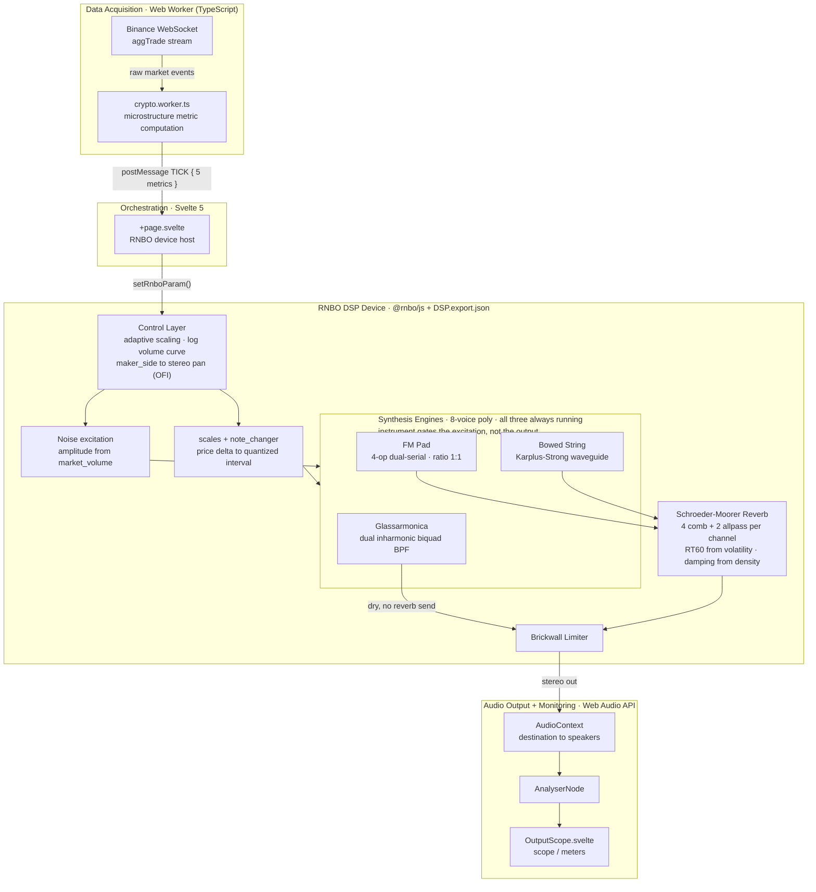

# SoniChain

A real-time synthesis engine that turns live crypto order flow into sound, so market state can be
monitored *passively* instead of read off a chart. Trades stream in from Binance over WebSocket, get
reduced to five microstructure metrics off the main thread, and drive three noise-excited synthesis
engines (subtractive, FM, and a physical-model waveguide) authored in RNBO and running as WebAssembly.
Ships as a web app and as a Tauri desktop app.

**[Matteo Caruso Linardon](https://carusolinardon.com)** (sole author: DSP design in Max/RNBO, frontend architecture, market-metric
layer, UX).

[](https://creativecommons.org/licenses/by-nc-sa/4.0/)

**[▶ Watch the live demo on YouTube](https://youtu.be/KYNdKtD0t8s)**. The app running on the live Binance
stream.

[](https://youtu.be/KYNdKtD0t8s)

The first version of this project worked, and I abandoned it for several months. It sounded static, it
became irritating well before the end of a working session, and it could not tell you which way the market
was moving because I had deliberately kept price off the pitch axis to avoid the obvious cliché. The
engineering problem in the rebuild was accepting that the cliché is the correct metaphor and that its
*continuity* is the defect, then finding what to give up in exchange for a display someone will actually
leave running.

## The short version

This is a long document, so here's where the interesting parts are if you don't want to read all of it:

- The first architecture I built, and dropped, is
  [written up with a diagnosis of why it failed](#the-version-i-threw-away).
- Price ended up mapped to pitch, the obvious choice, and the one I originally avoided on purpose.
  [Why I came back to it](#intervals) is probably the single most useful section here.
- The waveguide engine's "decay" knob
  [turned out not to control decay at all](#waveguide-a-decay-control-that-controlled-colour-instead): a
  loop filter with unity DC gain was quietly turning it into an integrator. The fix and the stability
  argument are in there too.
- Every design decision below is written next to what it cost, including the
  [adaptive scale, whose limits I ran into myself](#an-adaptive-scale) after using the thing for a while.
- The three switchable synth engines and the sensitivity control both exist because
  [listeners asked for them](#what-the-sessions-changed-in-the-shipped-build), not because I planned them
  from day one.
- Performance is [measured where I could measure it](#dsp-cost-32-of-one-core-and-it-does-not-move), and
  I've tried to be upfront about the couple of numbers I couldn't take, `outputLatency` mainly.
- The listening sessions were small: 5 people, about 20 minutes, no control group.
  [I say so plainly](#the-5-listener-session), including the one listener the display didn't work for at
  all.

> **Scope.** SoniChain is a perceptual monitoring instrument, not a trading tool. It issues no signals,
> executes no orders, holds no credentials, and makes no claim that listening to it improves any trading
> outcome. It reads Binance's public `aggTrade` stream and turns it into sound. Nothing here is financial
> advice.

---

## Table of Contents

- [Design Intent](#design-intent)
- [The version I threw away](#the-version-i-threw-away)
- [Design decisions and what they cost](#design-decisions-and-what-they-cost)
  - [Intervals, not glissando](#intervals)
  - [A stereo lean for order-flow imbalance, not a timbral cue](#a-stereo-lean-for-order-flow-imbalance)
  - [An adaptive scale, not a fixed one](#an-adaptive-scale)
  - [One excitation model across three engines](#one-excitation-model-across-three-engines)
  - [All three engines run at all times](#all-three-engines-run-at-all-times)
  - [Sensitivity as a user control, not a tuned constant](#sensitivity-as-a-user-control)
  - [Raw numbers on the wire, scaling at the ends](#raw-numbers-on-the-wire-scaling-at-the-ends)
  - [A 100 ms deaf spot on scale changes](#a-100-ms-deaf-spot-on-scale-changes)
- [What listening actually showed](#what-listening-actually-showed)
  - [Using it myself](#using-it-myself)
  - [The 5-listener session](#the-5-listener-session)
  - [What the sessions changed in the shipped build](#what-the-sessions-changed-in-the-shipped-build)
  - [What the sessions could not test](#what-the-sessions-could-not-test)
- [Two bugs worth reporting](#two-bugs-worth-reporting)
  - [FM: audible grain that was a filter problem](#fm-audible-grain-that-was-a-filter-problem)
  - [Waveguide: a decay control that controlled colour instead](#waveguide-a-decay-control-that-controlled-colour-instead)
- [What it costs to run](#what-it-costs-to-run)
  - [DSP cost: 3.2% of one core, and it does not move](#dsp-cost-32-of-one-core-and-it-does-not-move)
  - [The control path is not where the time goes](#the-control-path-is-not-where-the-time-goes)
  - [Next to the network, none of it matters](#next-to-the-network-none-of-it-matters)
  - [A property of the stream I did not expect](#a-property-of-the-stream-i-did-not-expect)
- [Architecture & Data Flow](#architecture--data-flow)
  - [Parameter Mapping](#parameter-mapping)
  - [Calibration state machine](#calibration-state-machine)
- [The RNBO Patch (DSP)](#the-rnbo-patch-dsp)
  - [Control & Routing Layer](#control--routing-layer)
  - [Engine A: Glassarmonica (Subtractive Resonator)](#engine-a-glassarmonica-subtractive-resonator)
  - [Engine B: FM Pad (Dual-Serial Frequency Modulation)](#engine-b-fm-pad-dual-serial-frequency-modulation)
  - [Engine C: Bowed String (Resonant Waveguide)](#engine-c-bowed-string-resonant-waveguide)
  - [Reverb: Schroeder-Moorer](#reverb-schroeder-moorer)
- [Limits and known gaps](#limits-and-known-gaps)
- [What Comes Next](#what-comes-next)
- [Tech Stack](#tech-stack)
- [Project Structure](#project-structure)
- [Getting Started](#getting-started)
- [The DSP Sync Workflow](#the-dsp-sync-workflow)
- [Data Source](#data-source)
- [References](#references)
- [License](#license)

---

## Design Intent

A chart answers *what happened* to someone who is looking at it. It answers nothing to someone who is
not. Market monitoring is a sustained-attention task with a bad ratio: hours of nothing, punctuated by
seconds that matter, on a channel that requires the eyes to be pointed at it the whole time.

Audition is the obvious substitute: it is omnidirectional, it does not require fixation, and the auditory
system is unusually good at detecting *change* in a stream it has stopped consciously attending to. This is
why sonification exists as a field. It's also why a lot of sonifications struggle in practice: mapping a
value directly to pitch tends to produce a continuous glissando, which starts to sound like an alarm, and
an alarm isn't something you want left running in the background.

> **This is a design position.** Tolerability over long sessions is the goal the
> mappings were built to serve and the reason the first version was scrapped; it is not something this
> project has measured. The evidence that exists is a pilot, and it is reported as one in
> [What listening actually showed](#what-listening-actually-showed).

---

## The version I threw away

Before this architecture there was a complete, working first version. It was built around a wavetable
oscillator pair, and its mapping table looked like this:

| Market data | Audio parameter | Synthesis technique |
| --- | --- | --- |
| 24h trend | Timbre (wavetable position) | Morphing across the Y axis (256 frames) between "bear" and "bull" spectral profiles |
| Price micro-variations | Beat frequency (detune) | Phase interference between two `phasor~`-driven oscillators (binaural-beat simulation) |
| Trade density | Amplitude (gain) | Dynamic gain mapping with `line~` for smooth envelopes |
| Price volatility | Pitch | Real-time quantization onto a G Mixolydian scale spanning two octaves |

Note what that table is trying to do: **pitch is deliberately assigned to volatility**
specifically to dodge the price → pitch cliché. It failed in three ways, and I abandoned the project for
several months.

**It was static.** A wavetable read at a stable rate produces a spectrum that changes only when the
morphing position changes. Market data moves the position slowly, so the sound had no internal life, and a
sound with no internal life becomes furniture within minutes. The ear stops parsing it, which is precisely
the failure mode a peripheral display cannot have.

**It became irritating over long sessions.** The thing it was designed not to be. Two detuned oscillators
producing a continuous beat frequency is a sustained, unresolving interference pattern. It is a fine effect
for thirty seconds and an unpleasant one for an hour.

**Market direction was unreadable.** Displacing pitch onto volatility avoided the cliché and cost me the
only auditory metaphor everyone already knows. Nothing in that mapping told you *which way* the market was
going in a form the ear could grab.

The restart came from inverting the assumption. The problem was never that price → pitch is
a cliché; it is a cliché because it works. The problem is the *continuous* mapping. Take the discrete
derivative of price, quantize it to a scale interval, and you keep the metaphor everybody understands while
removing the glissando that makes it unbearable.

The second decision was **physical modelling** instead of wavetables. A physically modelled resonator has
internal behaviour: energy enters, circulates, decays, interacts with the excitation. It sounds like
something is being *played*, which is the correct metaphor for this project, since the market is the
performer and the DSP is the instrument. A sample library would have bought that organic quality too, but
at the cost of shipping megabytes of audio in a desktop app.

Every engine below is a consequence of that second start. So is the fact that the noise excitation is
external and shared; it is the "bow" the market draws across whichever instrument is selected.

---

## Design decisions and what they cost

### Intervals

`price` isn't mapped straight to frequency. What drives pitch is its *discrete derivative* over the last
two ticks, stepped through a pre-quantized scale array: a positive Δ moves the pitch up, and the width of
the interval scales with |Δ|. Each engine runs 8 voices, so transients trigger overlapping discrete notes
that decay like a harp.

I rejected two other approaches on the way here. The first was price mapped straight to continuous pitch,
the thing every sonification demo reaches for. It's maximally faithful to the data and maximally
unlistenable: a portamento that never resolves just reads as a siren, and the ear never habituates to it.
The second, less obvious rejection was avoiding pitch for price altogether, which is what the
[previous version](#the-version-i-threw-away) did by putting pitch on volatility instead. That dodged the
cliché, but it also made market direction unreadable. The cliché exists because the metaphor is right; it
was only the continuity that had to go.

The cost is real: any price move smaller than a scale step is inaudible, so the display quantizes away
exactly the micro-structure a continuous mapping would keep. I took that trade anyway, because a display
people mute after ten minutes has an effective resolution of zero.

### A stereo lean for order-flow imbalance

`maker_side`, the buyer-is-maker flag that stands in for order-flow imbalance, drives the stereo image:
sell pressure leans left, buy pressure leans right. The two channel gains move in opposition between 1.0
and 0.28, about 11 dB apart, glided over 1 second so both channels always carry some signal and the image
drifts instead of flicking from side to side.

I considered coding that lean as timbre, or as a second pitch layer, and rejected both. They're decodable,
which is exactly the problem: anything a listener has to consciously interpret has already spent the
attention the display exists to save. Spatial position doesn't need interpreting. It's felt before it's
parsed.

A hard pan was the other option, ruled out for two reasons that both come back to leaving this running for
hours at a time: a full pan parks one ear on silence, which gets tiring, and at the trade rates this stream
hits, an instant pan would flicker on every other trade. The 1-second glide turns a binary flag into a
continuous lean, which is what lets it read as pressure building rather than as a string of individual
events.

The cost is that mono playback kills the cue outright. A single earbud, or any downstream mono-sum, adds
the two gains together, and that sum is identical whether the market is buying or selling, so the
information isn't just weakened, it's exactly cancelled. The most important signal in the whole display is
also the most fragile to how it actually gets listened to.

### An adaptive scale

The value range re-derives itself continuously instead of being fixed. A 30-second calibration window
captures the min and max for each metric; once that's set, the thresholds jump up to any new peak and then
decay linearly back toward zero over 60 seconds, so the mapping keeps re-ranging itself as the market's
regime changes. `scaling/recalibration` re-runs that capture on demand, and `OutputScope.svelte` mirrors
the same scheme on the UI side for the meters.

I tried a fixed range, calibrated once, first. It doesn't work: a quiet market goes inaudible, and a
volatile one saturates the top of the range and just sits there, so the display goes dead in exactly the
two conditions where it should be telling you the most.

This is where the real cost sits: absolute comparability is gone. The same pitch, the same brightness, the
same reverb tail can mean different things depending on when you're hearing them, because the display is
only ever telling you what's happening relative to the recent past. You can't step away for an hour, come
back, and read an absolute level off it. It's a change detector, not a gauge, and it has to be read as
one.

### One excitation model across three engines

All three engines are excited by the same external noise source, weighted by `market_volume`. That noise
never gets summed into the output directly; instead it drives the FM modulation-index envelope, and it
gets injected into the waveguide loop the way a pluck would be. `density` low-passes it before it reaches
any engine.

I could have given each engine its own native excitation instead, oscillator attacks for the FM voice, an
impulse for the string, and it would have been faster to build and sounded more conventionally "correct"
per engine. I didn't, because a shared excitation is what makes the rest of this design possible.

The cost showed up almost immediately: every engine had to be rebuilt around taking excitation from
outside itself, and that rebuild is where both bugs described below came from. None of the three engines
can produce a hard attack transient either, so the whole palette is sustained textures, nothing percussive.
What it buys back is that switching engines changes the timbre without changing what any metric means. The
mapping stays the same across all three voices, so whatever a listener has learned to associate with a
sound survives a theme switch. It's also, it turned out, the reason the switch itself is inaudible:
excitation you can route is excitation you can hand off from one engine to another without a click
([more on that below](#all-three-engines-run-at-all-times)).

Three engines exist at all because the listening sessions made it obvious that timbral tolerance is
personal. A texture one listener can leave running for an hour is one another wants turned off in five
minutes, and since the whole point of the display depends on someone being willing to keep it on, letting
people pick a voice they can live with isn't a nice-to-have, it's a requirement. Three felt like the
smallest number that covers meaningfully different characters: struck glass, a warm pad, a bowed string.

### All three engines run at all times

Nothing gets instantiated or torn down when the user switches theme. All three engine banks compute
continuously, all the time, and the `instrument` parameter just drives three `gate~ 8` objects that route
the shared noise excitation to whichever bank is active. The other two keep running with nothing feeding
them, so their resonators ring out their own tails naturally while the new one starts getting excited.

The obvious, more efficient choice would have been to gate or free the inactive banks, and the measured
cost below makes a real case for that. I didn't, because gating the excitation instead of the output
matters here specifically: these are resonant models with physical tails, and the gate sits upstream of
them. Cutting the output would chop the outgoing voice off mid-ring; cutting the excitation lets it decay
the way a struck instrument actually does. Switching engines costs no click, no mute, no gap, and none of
that comes from a crossfade I had to write, it just falls out of the topology. That's the real payoff of
[sharing one excitation across engines](#one-excitation-model-across-three-engines): once excitation is a
signal you can route, switching instruments becomes a routing problem instead of a voice-allocation
problem.

It costs roughly three times the DSP work for one audible engine, permanently, and the measurement backs
that up: [3.2% of one core, flat across every configuration](#dsp-cost-32-of-one-core-and-it-does-not-move).
The whole decision assumes there's headroom to spend, and it's only defensible because the numbers say
that headroom is actually there. On hardware where that 3% turned into 30%, I'd have to rethink it.

### Sensitivity as a user control

`market_volume` runs through a logarithmic transfer curve with three user-selectable settings: Low, Med,
High. Low turns the display into a quiet macro-event alarm; High exposes the micro-pulse underneath.

The obvious choice, and what the first version did, was one curve tuned by me, since I know the data and
could just pick the response myself. What changed my mind was a listener who explicitly wanted to hear
more than my tuning let through: the small movements I'd suppressed as noise were exactly the ones they
were listening for. There isn't a correct setting, because the setting isn't really a property of the
data. It's how much attention someone is willing to spend on this, and only they know that.

The cost is a control the user has to understand before the display behaves the way they want, and three
response curves I now have to keep coherent instead of one.

### Raw numbers on the wire, scaling at the ends

`crypto.worker.ts` computes and posts raw metrics, `price`, `market_volume`, `density` as the inter-onset
interval in milliseconds, `maker_side` as 0 or 1, `volatility` as the standard deviation of log-returns
over a 64-tick ring buffer, and normalizes none of it. Scaling happens twice downstream: in the RNBO
control layer for audio, and in `OutputScope` for the display. The only guarantee the worker gives is that
finite numbers cross the boundary; a `NaN` price short-circuits the tick before it can reach an RNBO
parameter and glitch the audio.

Normalizing once, inside the worker, would have given me a single scaler instead of two, and I considered
it. I didn't do it because audio scaling needs to happen at sample rate inside the DSP, and the display's
needs aren't the same as the DSP's.

That leaves real duplication: two adaptive normalizers built around the same idea, implemented separately,
that can drift apart, so the meter can read differently from what the ear is actually being told. It's the
first thing on my list to consolidate.

### A 100 ms deaf spot on scale changes

When the user switches musical scale, TICK → RNBO forwarding gets gated off for 100 ms (`scaleSwitching`
in `+page.svelte`).

I tried letting it forward straight through the switch, and it doesn't work: in-flight price events land
on the old scale array while the new one is still loading, which produces audible bichords, a
wrong-sounding artifact at exactly the moment the user is paying close attention to the sound.

Up to 100 ms of market data goes silently un-sonified as a result. That's a loss I can live with because
the user triggered it themselves; it would be a different story if it happened on its own.

---

## What listening actually showed

No controlled evaluation happened here, and I want to say that up front so the findings below get weighed
accordingly. What exists is roughly 4 hours of my own use, in the background while working, spread over
several days, plus one ~20-minute session with 5 friends who heard both this version and the abandoned
one, unblinded, with no task and no control condition. Call it a pilot at best. I'm reporting it because
in auditory-display work an honest pilot is worth more than a claim with no evidence behind it, not
because it settles anything.

### Using it myself

The thing I expected to be a failure turned out to be the design working as specified: **I never knew what
the market was actually worth.** The display gave me no absolute level at any point, which is exactly the
[cost of the adaptive scale](#an-adaptive-scale).

What did work is the part that matters: during strong buy or sell pressure, the pitch movement was
recognizable and **pulled my attention back without my having looked**. That is the actual specification:
capture, not readout.

One occurrence is worth reporting precisely. While working with the app running in the background, I
registered that Bitcoin had been dropping substantially for a while, before I had gone to look at anything.
The thought I had at the time was that a position with a stop-loss would have had more decision time than a
chart I was not watching would have given.

**What that is not:** I am not a trader, the position was hypothetical, nothing was backtested, and this is
a single event with no counterfactual. It demonstrates one thing only, and narrowly: on one occasion, the
sound crossed the attention threshold before the screen did.

### The 5-listener session

| Listener profile | Response |
| --- | --- |
| 3 × finance-literate investors | Found it useful |
| 1 × musician | Found it intuitive |
| 1 × non-investor | **Could not correlate price movement with pitch movement** |

**The negative result is the informative one.** Three listeners with a market model and one with a musical
model each had something to hook the mapping onto. The listener with neither did not find the display
unpleasant; they found it *meaningless*. This says the sonification is not self-explanatory: it assumes a
pre-existing model of what a price move signifies, and supplies the acoustic cue rather than the concept.
For a professional monitoring instrument that assumption is probably fine. As a general claim about
intuitiveness it is not, and I have not addressed it: an onboarding or training mode is the honest fix,
not a mapping change.

### What the sessions changed in the shipped build

Two features exist because of feedback on the earlier version:

- **More than one voice.** Timbral tolerance turned out to be personal enough that a single texture would
  have lost listeners outright → the three switchable engines.
- **The logarithmic sensitivity curve and its three presets.** One listener wanted to hear the light
  movements I had tuned out.

### What the sessions could not test

**Fatigue, the central claim of the entire project.** A 20-minute session cannot measure whether something
is tolerable for hours; 20 minutes is inside the window where even the abandoned version was still
pleasant. The only exposure long enough to speak to it is my own ~4 hours, which is n = 1 and maximally
biased. Every fatigue-related statement in this README is therefore design rationale, grounded in
psychoacoustic literature and in the specific failure of the previous version.

---

## Two bugs worth reporting

Both are in the shipped source with their fixes. They are here because the diagnosis is more informative
than the feature list.

### FM: audible grain that was a filter problem

**Symptom.** The FM pad had a persistent roughness, worst in the reverb return.

**Wrong hypothesis.** The modulation index was too high and the spectrum was collapsing into buzz. It was
not: at the 1:1 carrier:modulator ratio the index is floored at `0.35` and hard-clamped at `2.55`,
deliberately far below the ~4-5 where sidebands go dense.

**Root cause.** A single 15 ms one-pole follower was driving *both* amplitude and modulation index. 15 ms
passes energy in the band that Zwicker & Fastl place in the roughness region (flutter to ~20 Hz, roughness
20-300 Hz). On the amplitude path that is harmless. On the index path it is phase modulation of the carrier
at a perceptible rate (**PM-index jitter**), which sprays spurious sidebands.

**Fix.** Decouple the followers: 15 ms for amplitude, **40 ms for the index**, placing the index path
below the lower roughness boundary. The reverb was a red herring that pointed the right way: the output
leaky integrator and the reverb combs are both leaky-integrator topologies, so they accumulated and
prolonged the artifact, which is why it was loudest there.

### Waveguide: a decay control that controlled colour instead

**Symptom.** A fixed-frequency buzz, independent of `f0`, that grew rather than decayed. Turning the
"decay" coefficient changed the timbre but not the decay time.

**Root cause.** The original one-pole loop filter had **unity DC gain for any feedback coefficient**. So
that coefficient set colour only, and at DC the loop degenerated into a perfect integrator over the delay
period: any DC component of the excitation accumulated without bound. The parameter named "decay" was never
a decay parameter.

**Fix** (Revision 5). Three explicit stages replace one implicit one:

1. an **explicit loop gain < 1** (`DECAY_MAX = 0.995`) separated from damping; this is the actual decay,
   driven by `volatility` (inversely: rising volatility lowers the loop gain);
2. a **first-order DC blocker inside the loop** (`y[n] = x[n] − x[n−1] + R·y[n−1]`, `R = 0.999`, ≈ 7-8 Hz
   cutoff @ 48 kHz), nulling the loop's DC gain so no DC ever circulates;
3. **energy normalization of the injection** (`× (1 − loop_gain)`): at high Q the comb's resonant peak is
   ≈ `1/(1 − loop_gain)` ≈ 200, so an uncompensated injection at high `market_volume` would clip. With it,
   steady-state amplitude tracks injection level *independently of* `loop_gain`, and `loop_gain` controls
   only tail duration.

**Guarantee.** Loop transfer `= HP(z)·loop_gain·LP(z)` with `|HP| ≤ 1`, `|LP| ≤ 1`, `loop_gain < 1` ⇒ loop
gain `< 1` at every frequency and `→ 0` at DC. Unconditionally stable, by construction rather than by
tuning.

---

## What it costs to run

Apple M4 Pro (14 logical cores), Chromium 149 headless, 48 kHz, `@rnbo/js` 1.3.4,
the shipped `DSP.export.json`. Each figure below states its method, and the two that could not be measured
are named as such.

### DSP cost: 3.2% of one core, and it does not move

Rendering 15 s of stereo output through the whole device in an `OfflineAudioContext`, with the five metrics
driven at 2 Hz through `suspend()`/`resume()`:

| Configuration | Wall clock for 15 s of audio | Share of one core |
| --- | --- | --- |
| Graphite, driven | 476.4 ms | 3.18% |
| Slate, driven | 476.9 ms | 3.18% |
| Bone, driven | 479.4 ms | 3.20% |
| Slate, parameters static | 471.7 ms | 3.14% |
| Slate, `master_volume` 0 (silent) | 479.1 ms | 3.19% |

**The interesting result is the flatness.** Switching engine changes the cost by 0.02 percentage points, and
muting the output changes nothing at all. All three engines are computed at all times: the patch
instantiates 8 voice codeboxes per engine plus 2 reverb instances, 26 signal cores in total, and
`instrument` routes the shared excitation to one bank rather than choosing which bank runs. That is
[a deliberate trade for a seamless theme switch](#all-three-engines-run-at-all-times), and this table is
its price tag: three engines' worth of DSP for one audible voice. Picking a theme therefore has no
performance meaning. Driving the parameters costs 0.04 pp over static ones, which is inside the noise.

**Caveat.** An offline render measures *throughput*, not real-time scheduling. It establishes that the DSP
needs about 3% of a core's worth of work; it does not prove the audio thread always meets its deadline on a
loaded machine, which is a different measurement I have not made.

### The control path is not where the time goes

- **Worker metric computation: 0.332 µs per tick** (median of 12 runs of 200,000 ticks, Node 26, same
  machine; the ring buffer and log-return maths lifted verbatim from `crypto.worker.ts`). At the busiest
  trade rate I measured on the live stream that is ~0.0004% of a core.
- **Worker → main `postMessage`: below 0.1 ms at p99**, which is the resolution Chrome exposes; 1,800 warm
  round trips never resolved above one tick of the clamped timer.
- **Parameter set → audible:** one render quantum (**2.667 ms** at 48 kHz) plus `AudioContext.baseLatency`,
  **5.333 ms** in this build.
- **`outputLatency`: not measured.** Headless Chrome reports 0 because there is no audio device attached.
  On real hardware it adds the device buffer and it will dominate every number in this list. I am not going
  to quote a figure I could not take.

### Next to the network, none of it matters

Sampling the live `btcusdt@aggTrade` stream from this machine, two windows of 240 s and 180 s:

| | 240 s window | 180 s window |
| --- | --- | --- |
| Trades per second | 12.93 | 7.90 |
| Event time → local receipt, p50 | 86 ms | 86 ms |
| Event time → local receipt, p99 | 402 ms | not recorded |

The entire software path costs single-digit milliseconds against ~86 ms of network delay before a tick even
arrives, with a p99 near 400 ms. This is the conclusion the measurements actually license: there is nothing
worth optimizing on my side of the socket, and any latency claim about this app is really a claim about
Binance and the route to it.

### A property of the stream I did not expect

**61.6% of consecutive `aggTrade` events carry the same millisecond timestamp.** Since `density` is defined
as `T[n] − T[n−1]`, it is exactly **0 on about six ticks in ten**, and both sampling windows agree on this.
The metric is not the smooth rate signal its name suggests; it is bimodal, a mass of zeros plus a long tail
(non-zero p50 131 ms, p90 943 ms, max 3.3 s).

The 300 ms smoothing ramp on the density control path absorbs most of it, which is why it never surfaced as
an audible defect, but the honest reading is that `density` measures *burst membership* as much as it
measures tempo. It is documented here rather than fixed: the correct definition would be trades per unit
time over a window, which is a different metric with a different feel, and changing it means re-tuning every
mapping it drives.

---

## Architecture & Data Flow

The signal path is **strictly unidirectional**: the worker computes metrics, the Svelte orchestrator
forwards them as RNBO parameters, the DSP device synthesizes, and the Web Audio graph routes to output and
to monitoring. There is no feedback path from audio back into the data layer: the audio can never
influence what the display is measuring.



**Why a worker at all.** Metric computation runs per trade event at whatever rate Binance delivers, which
is bursty and unbounded. On the main thread a burst competes with the render loop and with the RNBO device's
control updates. Off-thread, a burst can only delay itself.

### Parameter Mapping

Each market metric modulates one DSP target. This table is the design: it is where market semantics become
perceptual attributes.

| Market metric | DSP target | Perceptual intent |
| --- | --- | --- |
| `maker_side` (order flow imbalance) | Stereo lean: **Bearish → L**, **Bullish → R** (gains 1.0 / 0.28, glided over 1 s) | Spatial, pre-attentive read of market lean; felt before it is parsed |
| `price` (discrete Δ via `note_changer`) | Pitch / interval: **Δ > 0 → ascending**, width ∝ \|Δ\| | Direction *and* magnitude, as a musical step rather than a slide |
| `market_volume` | Noise excitation amplitude (log curve; Low / Med / High) | Event intensity; user-selectable immersion depth |
| `density` (inter-onset interval, ms) | Filter cutoff / brightness, comb gain, detune rate, reverb damping\* | Texture: a sparse market reads as separate events, bright and close; a busy one thickens into a darker, more diffuse wash |
| `volatility` (std-dev of log-returns, 64-tick window) | Decay / feedback / loop gain, reverb RT60,\* all **inversely** | Definition: a calm market rings and sustains, a turbulent one dries out so that fast events stay separable |

\* The reverb targets apply on **Slate** and **Bone** only. **Graphite** is routed dry (see
[Reverb](#reverb-schroeder-moorer)), so on that theme those two metrics act through the engine alone,
without a spatial dimension.

**`density` is an interval, not a rate.** It carries the inter-onset time in milliseconds, so its numeric
value grows as the market *slows down*. Everything it drives moves with the parameter, not with the
intuition behind its name: a sparse market opens the excitation filters, widens the detune and darkens the
reverb tail, while a busy one closes the filters and lets the tail stay bright. The result is that quiet
flow sounds like distinct, present events and heavy flow thickens into a wash.

**`volatility` runs inversely everywhere**, and consistently so: rising volatility lowers the loop gain in
each engine *and* shortens the reverb tail, so the whole display becomes drier and more articulate at once
rather than sending mixed signals. The intuitive mapping would be the opposite one (turbulence → a long
reverberant wake), and it is the wrong one here: it buys an evocative image at the cost of smearing
together the events the listener needs to count when the market is moving fastest.

The `market_volume` row is the only one the user can re-shape at runtime; see
[Sensitivity as a user control](#sensitivity-as-a-user-control) for why that
particular parameter, and not the others, was handed over.

### Calibration state machine

Audio output is gated on startup by an explicit phase sequence:

`initial-connecting → pending-calibrate → recal-connecting → calibrating → idle`

Two constraints shaped it. First, the adaptive scaler has nothing to scale against until it has seen the
market for a while, so the 30-second capture window has to complete before the mapping means anything:
audio before that point is misleading, not merely rough. Second, browsers suspend the `AudioContext` until a
user gesture, so the flow has to route through a deliberate click anyway.

The handoff is driven by `calibrationPhase`, **not** by a `hasCalibrated` boolean: the earlier boolean
version broke on re-calibration, when the phase and the history disagreed. The Calibrate button is also
locked for ~1 s after the prompt first paints, because on first paint a user's click is landing on a button
that appeared under their cursor.

---

## The RNBO Patch (DSP)

The DSP is a single RNBO export (`DSP.export.json`): control/routing layer, three polyphonic engines, and a
stereo reverb that two of the three engines are sent through. The four signal cores are **RNBOScript
codeboxes**; what follows is documented from those sources, which are the source of truth for constants and
topology.

A recurring theme across all of them: **per-sample one-pole smoothing (τ ≈ 5-10 ms) on every control
parameter**, plus explicit safety clamps and denormal flushing. This is not decoration: the control values
arrive at WebSocket rate in discrete jumps, and stepping a filter coefficient in one sample is zipper noise
by construction.

### Control & Routing Layer

- **Ingest & master output.** Receives the five metrics, applies spatialization and scaling, and feeds a
  **brickwall limiter** upstream of the stereo output. The limiter exists because the display's dynamics are
  driven by the market, which does not agree to a headroom budget in advance.
- **Adaptive scaling subpatch.** Peak detector with an adaptive threshold whose window progressively
  narrows to track macroscopic range shifts (see [the trade-off](#an-adaptive-scale)).
- **`market_volume` sensitivity.** Logarithmic transfer curve, Low / Med / High.
- **Spatialization.** `maker_side` → stereo panorama as a direct order-flow-imbalance read-out.
- **Frequency assignment (`scales` + `note_changer`).** `scales` emits pre-quantized frequency arrays,
  constraining output to the selected scale. `note_changer` computes the discrete derivative of the last two
  `price` ticks and drives the engine switch from the active UI theme.

### Engine A: Glassarmonica (Subtractive Resonator)

High-Q subtractive synthesis emulating the inharmonic spectrum of a glass harmonica. Selected by the
**Graphite** theme, and the only engine routed **dry**: it never reaches the
[reverb](#reverb-schroeder-moorer).

- **Topology.** Two parallel resonant **biquads** (Direct Form I), RBJ constant-0 dB-peak band-pass
  sections (`α = sin ω / 2Q`, `b0 = α/a0`, `b2 = −α/a0`, `a1 = −2cos ω/a0`, `a2 = (1−α)/a0`). The second is
  tuned to **f0 × 2.756** (an inharmonic partial ratio), which is what makes it read as glass rather than
  as a filtered tone. Coefficients recomputed at sample rate to follow modulation.
- **Self-sustaining resonance.** A **cross-channel feedback** loop (`input_L = in1 + fb_R·feedback`,
  `input_R = in2 + fb_L·feedback`) sustains the ring across the stereo pair.
- **Excitation.** Pre-weighted white noise, low-passed as a function of `density`.
- **Modulation.** `density` → cutoff; `volatility` → feedback gain, inversely (more volatility, less
  ring). The codebox exposes `f0`, `Q`,
  `feedback` as inlets; metric-to-inlet mapping is applied upstream.

### Engine B: FM Pad (Dual-Serial Frequency Modulation)

A timbrally stable, noise-excited "warm bell" pad. Selected by the **Slate** theme, and sent through the
[reverb](#reverb-schroeder-moorer). See
[the jitter bug](#fm-audible-grain-that-was-a-filter-problem) for how the envelope structure
got the way it is.

- **Topology.** Four operators in two independent serial chains, **Op2 → Op1 (L)** and **Op4 → Op3 (R)**,
  at a **carrier:modulator ratio of 1:1**. An integer ratio places every sideband on an integer multiple of
  f0 (Chowning 1973), i.e. a fully harmonic spectrum.
- **Excitation model.** It is **100 % external**: `in1`/`in2` carry `market_volume`-weighted noise, never summed
  into the output. It drives the modulation-index envelope and the feedback path, the way excitation drives
  the delay line in Karplus-Strong. When the noise falls to zero, energy already in transit continues to
  decay by the coefficient from `in4`: a physical tail, not a hard cutoff.
- **Modulation index.** Floor `0.35` + envelope component, hard-clamped at `2.55`. Deliberately
  conservative: at 1:1, indices past ~4-5 collapse the spectrum into buzz.
- **Decoupled envelopes.** 15 ms follower → amplitude, 40 ms follower → index. See the bug above.
- **Stereo width.** Symmetric detune up to **±1.5 Hz** between carrier chains (≈ 3 Hz beat): slow
  chorus-like breathing, below the threshold where it would read as inharmonicity.
- **Decay.** Leaky integrator on the output, modelling a K-S-like physical tail post-excitation.
- **Modulation.** `density` → noise low-pass and detune rate; `volatility` → leaky-integrator feedback,
  inversely (more volatility, shorter tail).
- **Disclosure (from source).** No oversampling in this codebox; the conservative index keeps FM products
  clear of Nyquist. If f0 is pushed past ~1-2 kHz in sound design, 2× oversampling at the patcher level
  would be required.

### Engine C: Bowed String (Resonant Waveguide)

A continuously excited physical model (Karplus-Strong / Jaffe & Smith 1983), the only string-bodied voice
in the palette. Selected by the **Bone** theme, and sent through the [reverb](#reverb-schroeder-moorer).
Its stability story is [above](#waveguide-a-decay-control-that-controlled-colour-instead).

- **Topology.** Tuned **delay line** (length `sr / f0`, fractional, 2-tap linear FIR interpolation) with
  filtered feedback; external noise injected continuously into the loop.
- **Damping.** Fixed-coefficient averaging filter `0.5·(x[n] + x[n−1])` (zero at Nyquist), classic K-S,
  frequency-invariant. The two `density`-controlled excitation stages (brightness LP, resonant comb) are
  strictly feedforward, **outside** the loop: anything inside it is part of the stability argument.
- **Transitions.** Linear **crossfade** (`XFADE_SAMPLES = 480`) on real fundamental jumps, eliminating
  phase clicks from delay-buffer discontinuity.
- **Disclosure (from source).** Not empirically verified in this context (no RNBO runtime available at
  authoring time). Linear delay interpolation has less flat high-frequency phase than an allpass
  (Välimäki & Laakso 2000) but is intrinsically stable, the right trade in a loop whose stability was
  already the problem.

### Reverb: Schroeder-Moorer

**Two of the three engines are routed through it: Slate (FM pad) and Bone (bowed string). Graphite
(glassarmonica) is not.** The glassarmonica already sustains itself through its own cross-channel feedback
loop, so it is the dry, close voice of the set; the other two get their space from here.

- **Topology.** **4 parallel combs + 2 cascaded allpass per channel** (Schroeder 1962; Moorer 1979), with
  in-loop damping. RT60→gain derivation follows Smith, *Physical Audio Signal Processing* (CCRMA).
- **Decorrelation.** Comb lengths **coprime** and decorrelated L/R (Dattorro 1997), maximizing echo
  density without audible periodicity. Specified in samples at 48 kHz, auto-rescaled by `sr / 48000` to
  preserve temporal ratios across sample rates.
- **Decay law.** `g = 10^(−3·d / (RT60·sr))`, exactly −60 dB at `t = RT60`. A one-pole LPF per comb loop
  (`damping`) models the faster HF absorption of real materials (Kuttruff).
- **Allpass stage.** `y[n] = −g·x[n] + x[n−d] + g·y[n−d]`, `g = 0.6` (inside `[0.5, 0.7]` for stability
  and echo density without metallic colouration).
- **Wet/dry.** Deliberately **linear**, not equal-power. The reverb is additive and the dry/wet sum is
  decorrelated, so a linear crossfade does not produce the loudness dip equal-power exists to fix. Linear is
  the correct choice here, not an omission.
- **`volatility` → RT60 (tail length), inversely.** A calm market gets the **longer** tail; as volatility
  rises the space contracts and dries out. Traced through the patch, the swing is **3.25 s → 2.50 s** on
  Slate and **1.75 s → 1.50 s** on Bone, across the full normalized range of the metric. The direction is
  the useful one: a volatile market is already producing events fast, and a long tail there would smear
  them into each other exactly when they most need to stay separable, while a quiet market has gaps that
  the longer tail fills, so the display never goes fully silent between events.
- **`density` → damping (how fast the highs die inside the tail).** The damping coefficient runs
  **0.2 → 1.0** across the metric's range, from a bright, near-metallic tail to a dark one. Note that
  `density` is the *inter-onset interval in milliseconds*, so its numeric value runs **inverse** to how busy
  the market is: a tight trade flow means a small value, and therefore the brighter tail.
- **Send levels.** Slate is **fully wet** (mix = 1.0), Bone sits at **0.8**, predelay is 0 on both. The FM
  pad has no dry path at all, which is why the [PM-index jitter](#fm-audible-grain-that-was-a-filter-problem)
  was audible there first and loudest.

**Why this is the right channel for these two metrics.** Nobody listening is meant to notice that RT60
moved or that a damping coefficient changed, and nothing in the interface tells them. Reverb time and
HF absorption are the two attributes the ear reads as *the room* rather than as *the sound*, and a room is
something you notice having changed without ever having attended to it. Putting volatility and density here
buys a state cue that costs no attention at all, which is the opposite of what a foreground cue like pitch
does. It is also why the swing is kept narrow (0.75 s of RT60 on Slate, not the full range the topology
could reach): the moment a space change becomes identifiable as an effect, it has started competing for the
attention the display exists to save.

---

## Limits and known gaps

Written out here in plain language, because leaving them unsaid wouldn't make them any less true.

- **The evaluation is a pilot, not a study.** n = 5, ~20 minutes, friends, unblinded, no task and no
  control condition, plus ~4 hours of self-use by the author. See
  [What listening actually showed](#what-listening-actually-showed). A real evaluation would be task-based
  with multiple listeners over sessions long enough to reach fatigue, per auditory-display methodology. I
  have not run one, and the sessions I did run are structurally incapable of testing the project's central
  claim.
- **It is not self-explanatory.** One listener with no market model could not connect pitch movement to
  price movement at all. The display supplies a cue, not a concept; it assumes the listener already knows
  what a price move means. Unaddressed: there is no onboarding or training mode.
- **The performance picture has two holes.** `outputLatency` was not measurable headless, so the hardware
  side of the audio path is unquantified; and an offline render proves throughput, not that the audio thread
  meets its deadline under load. Everything else in [What it costs to run](#what-it-costs-to-run) is measured
  on one machine, and single-machine numbers are indicative, not portable.
- **The cost of the seamless switch scales with the target.** Three engines run for one audible voice by
  [design](#all-three-engines-run-at-all-times). At 3.2% of a core that is cheap; on hardware an order of
  magnitude weaker it would not be, and the fix is not free because the always-on banks are what make the
  switch inaudible.
- **Engine C is unverified against a runtime.** Its stability argument is analytic; there was no RNBO
  runtime available when it was authored.
- **The adaptive scale removes absolute comparability.** The display is a change detector, not a gauge.
  This is by design, and it is the design's main limitation.
- **The order-flow cue does not survive mono.** Single-earbud or mono-summed playback loses the most
  important signal in the display, with no redundant encoding.
- **Two normalizers, one intent.** The RNBO scaler and the `OutputScope` scaler implement the same idea
  separately and can disagree. First thing on the consolidation list.
- **No test framework and no CI.** `npm run check` (svelte-check, strict) is the only automated gate. For a
  project whose correctness is largely audible, that is a real gap, not a stylistic one.
- **Binance `aggTrade` only.** One venue, one stream type, no order-book depth, no cross-venue aggregation.
  Depth would be the most informative missing metric and is deliberately out of scope for now.

---

## What Comes Next

In priority order, and each one is here because something above says it should be:

1. **Close the two measurement holes.** `outputLatency` on real hardware (the headless harness cannot see
   an audio device), and a real-time run under CPU load to confirm the audio thread holds its deadline,
   which an offline render cannot show. The rest is already in
   [What it costs to run](#what-it-costs-to-run).
2. **A listening protocol long enough to reach fatigue.** The one claim the project is organised around is
   the one the 20-minute sessions could not touch. Sessions of an hour or more, a concurrent task so the
   display is genuinely peripheral, and listeners who are not my friends.
3. **An onboarding mode.** One listener in five got nothing from the display because it assumes a model of
   price movement they did not have. A short guided pass (isolated cues, then combined) would test whether
   that is a mapping problem or a training problem. I currently believe it is the second, and believing is
   not knowing.
4. **Collapse the two normalizers.** One adaptive scaler, one source of truth, used by both the DSP and the
   meters. Today they can disagree and the user cannot tell which one is lying.
5. **Order-book depth as a sixth metric.** The most informative thing `aggTrade` cannot see. It needs a
   perceptual axis that is still free, which (given how deliberately the current five are separated) is
   the actual design problem, not the data plumbing.
6. **Release engine banks after their tail has decayed**, rather than gating them outright. Only worth doing
   on a constrained target, and it is the one form of the optimization that does not break the seamless
   switch: a bank can be freed once it has finished ringing, not the moment it stops being excited.
7. **Redefine `density` as a rate.** Six ticks in ten arrive with a zero inter-onset interval, so the metric
   partly measures burst membership. Trades per unit time over a window is the correct definition, and
   adopting it means re-tuning every mapping it drives.

---

## Tech Stack


| Layer | Technology |
| --- | --- |
| Frontend / orchestration | **SvelteKit 2**, **Svelte 5** (`+page.svelte` as orchestrator) |
| Audio engine | **RNBO** Web export via **`@rnbo/js` 1.3.4**, loaded from `static/DSP.export.json` |
| Data layer | TypeScript **Web Worker** (`crypto.worker.ts`): Binance **WebSocket** + metric computation |
| Audio I/O & monitoring | **Web Audio API** directly: `AudioContext` + `AnalyserNode` (no wrapper) |
| Build tool | **Vite 6**, with a custom `sync-dsp` plugin |
| Desktop shell | **Tauri 2** (Rust); the frontend also runs as a pure web app in development |
| Dev server | Fixed port **1420** (`strictPort: true`, required by `tauri dev`) |

---

## Project Structure

```text
SoniChain/
├── src/
│   ├── routes/
│   │   ├── +page.svelte          # Orchestrator: hosts the RNBO device, wires worker → setRnboParam
│   │   └── +layout.ts            # Disables SSR globally (SPA mode for Tauri)
│   ├── components/
│   │   ├── AudioControls.svelte  # Volume fader, asset / scale / sensitivity selectors, play/pause
│   │   ├── CryptoChart.svelte    # Price history chart with musical-note overlay
│   │   └── OutputScope.svelte    # AnalyserNode-backed scope / goniometer / dB meters
│   ├── RNBO/
│   │   ├── DSP1.json             # Authoring-side RNBO export (source of truth for the DSP)
│   │   ├── DSP1.license
│   │   └── dependencies.json
│   ├── crypto.worker.ts          # Binance WebSocket + microstructure metric computation
│   ├── themes.ts                 # Three themes (graphite / slate / bone) as CSS vars + canvas hex
│   ├── help.ts                   # Contextual help-bubble store + Svelte `help` action
│   └── app.html                  # SPA HTML shell
├── static/
│   └── DSP.export.json           # Runtime device, synced from src/RNBO/DSP1.json; do not edit
├── src-tauri/
│   ├── src/
│   │   ├── main.rs               # Tauri entry point
│   │   └── lib.rs                # Tauri commands
│   ├── tauri.conf.json           # Window config: 800×600, title "SoniChain"
│   ├── Cargo.toml
│   ├── build.rs
│   └── capabilities/             # Tauri v2 security capabilities
├── vite.config.js                # Vite 6 config + sync-dsp plugin + strictPort 1420
└── package.json
```

Selecting a theme is not only a colour change: `THEME_INSTRUMENT` in `+page.svelte` maps each theme to an
RNBO `instrument` value, so the theme picker *is* the engine selector. One control, because they are one
choice: the visual and sonic character of the display should not be able to disagree.

---

## Getting Started

### Prerequisites

- **Node.js** ≥ 20 (required by Vite 6 / SvelteKit 2) and a package manager (npm / pnpm).
- **Rust** (stable) and the platform **Tauri 2 prerequisites**, listed in the
  [Tauri prerequisites guide](https://v2.tauri.app/start/prerequisites/); desktop build only.
- A network connection for the Binance WebSocket feed. No API credentials: public market streams only.

### Installation

```bash
git clone https://github.com/BitResonant/SoniChain.git
cd SoniChain
npm install
```

### Development

```bash
npm run dev          # pure web app, fixed port 1420
npm run tauri dev    # inside the Tauri desktop shell
```

### Build

```bash
npm run build        # web build
npm run preview      # serve the production build locally
npm run tauri build  # native desktop bundle
```

### Type-checking

```bash
npm run check        # svelte-kit sync + svelte-check (strict TypeScript)
npm run check:watch  # same, in watch mode
```

This is the only automated correctness gate: run it after any TypeScript or Svelte change.

---

## The DSP Sync Workflow

The RNBO patch is authored as `src/RNBO/DSP1.json` but consumed at runtime as `static/DSP.export.json`. A
custom Vite plugin, **`sync-dsp`**, keeps them in lockstep:

- **On `buildStart`.** Copies `src/RNBO/DSP1.json` → `static/DSP.export.json`.
- **During `dev`.** Watches the source; on change, re-copies and triggers a full page reload so the new
  device loads immediately. The page fetches it with a cache-busting `?v=<timestamp>` query.

**To edit the DSP:** change the patch in RNBO and re-export to `src/RNBO/DSP1.json`. Never hand-edit
`static/DSP.export.json`: it is a generated artifact, and edits there are silently overwritten on the next
build. The reason for the plugin is exactly that: without it, the two files drift and the bug looks like a
DSP bug.

---

## Data Source

Market data comes from **Binance** over a **WebSocket** (`<symbol>@aggTrade`), consumed in
`crypto.worker.ts`, which reconnects with a 3 s backoff on close. The worker computes the five
microstructure metrics off the main thread and pushes them via `postMessage` `TICK` events.

It is defensively hardened against the stream rather than against a spec: malformed JSON frames are caught
and dropped, a non-finite `price` short-circuits the tick, and `market_volume` is coerced to a finite
number. In an audio pipeline a single `NaN` is not a logged warning: it propagates into an RNBO parameter
and the output audibly breaks.

---

## References

The DSP design is grounded in the following literature, cited throughout the codeboxes:

- Chowning, J. M. (1973). *The Synthesis of Complex Audio Spectra by Means of Frequency Modulation.* JAES 21(7).
- Karplus, K., & Strong, A. (1983). *Digital Synthesis of Plucked-String and Drum Timbres.* CMJ 7(2).
- Jaffe, D. A., & Smith, J. O. (1983). *Extensions of the Karplus-Strong Plucked-String Algorithm.* CMJ 7(2).
- Schroeder, M. R. (1962). *Natural Sounding Artificial Reverberation.* JAES 10(3).
- Moorer, J. A. (1979). *About This Reverberation Business.* CMJ 3(2).
- Dattorro, J. (1997). *Effect Design, Part 1: Reverberator and Other Filters.* JAES 45(9).
- Välimäki, V., & Laakso, T. I. (2000). *Principles of Fractional Delay Filters.* IEEE ICASSP.
- Zwicker, E., & Fastl, H. *Psychoacoustics: Facts and Models.* Springer.
- Kuttruff, H. *Room Acoustics.* CRC Press.
- Smith, J. O. *Physical Audio Signal Processing.* Online book, CCRMA, Stanford University.

---

## License

SoniChain is released under the [Creative Commons Attribution-NonCommercial-ShareAlike 4.0
International License (CC BY-NC-SA 4.0)](https://creativecommons.org/licenses/by-nc-sa/4.0/).
You may share and adapt the material for non-commercial purposes as long as you credit
[Matteo Caruso Linardon](https://carusolinardon.com), link back to the license, and
distribute any derivative work under the same terms. Full terms are in the
[`LICENSE`](./LICENSE) file in the repository root.

**Exception.** The RNBO-generated DSP export (`src/RNBO/DSP1.json` and
`static/DSP.export.json`) is machine-generated by Cycling '74's Max/RNBO export
tool and is separately licensed under the terms in
[`src/RNBO/DSP1.license`](./src/RNBO/DSP1.license); it is not covered by the
CC BY-NC-SA grant above.

---

SoniChain, BitResonant
