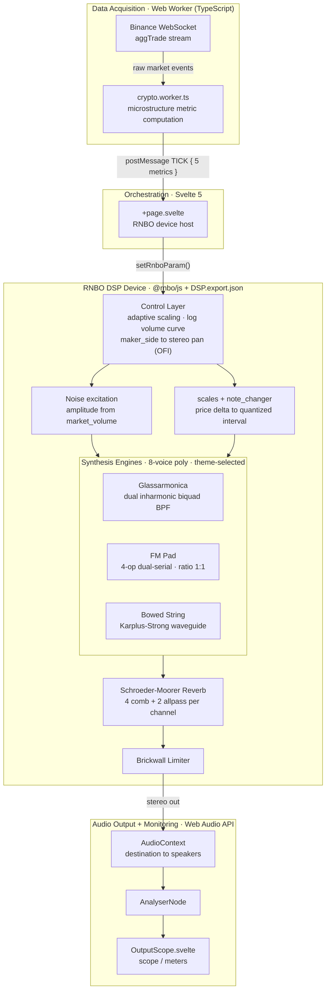

# SoniChain

**Real-time sonification of Binance market microstructure through an RNBO DSP engine.**

SoniChain turns a live crypto order flow into a continuous acoustic field, so that market state can be
monitored *peripherally* — kept in the background of attention — instead of being read off a chart.
Five microstructure metrics drive three noise-excited synthesis engines (subtractive, FM, physical-model
waveguide) and a Schroeder–Moorer diffusion network.

**[▶ Watch the live demo on YouTube](https://youtu.be/KYNdKtD0t8s)**


---

## At a glance

**Role** — sole author: DSP design in Max/RNBO, frontend architecture, market-metric layer, UX. This is the
second version; the [first one was abandoned](#the-version-i-threw-away) for several months and restarted
from scratch.

**Problem** — a price chart demands the eyes. A trader watching one screen is not watching the other
five. Sound is the only channel that can stay open while attention is elsewhere — but the naive mapping
(price → continuous pitch) produces a siren, and a siren is unlistenable after ten minutes. The design
problem is not *encoding* data as sound; it is encoding it in a form that survives hours of exposure.

**Decisions, and what each one cost** — pitch is quantized to scale intervals (loses resolution on small
moves); order-flow imbalance is hard-panned L/R (dies on mono playback); the display re-ranges itself
adaptively (loses absolute comparability across time); all three engines are excited by the same external
noise source (no engine can produce a hard attack transient).

**Evidence** — informal: ~4 hours of my own background use across several working days, plus a ~20-minute
session with 5 listeners (both versions of the project). No controlled test, n = 5, friends. Two concrete
features in the shipped build exist because of what those sessions surfaced. Where a number appears in this
README it is a constant from the source, never a benchmark: no CPU or latency figure is claimed.

**Limits** — see [Limits and known gaps](#limits-and-known-gaps). The honest version is at the bottom of
this file, not omitted from it.

---

## Table of Contents

- [The problem](#the-problem)
- [The version I threw away](#the-version-i-threw-away)
- [Design decisions and what they cost](#design-decisions-and-what-they-cost)
- [What listening actually showed](#what-listening-actually-showed)
- [Two bugs worth reporting](#two-bugs-worth-reporting)
- [Architecture & Data Flow](#architecture--data-flow)
  - [Parameter Mapping](#parameter-mapping)
  - [Calibration state machine](#calibration-state-machine)
- [The RNBO Patch (DSP)](#the-rnbo-patch-dsp)
  - [Control & Routing Layer](#control--routing-layer)
  - [Engine A — Glassarmonica (Subtractive Resonator)](#engine-a--glassarmonica-subtractive-resonator)
  - [Engine B — FM Pad (Dual-Serial Frequency Modulation)](#engine-b--fm-pad-dual-serial-frequency-modulation)
  - [Engine C — Bowed String (Resonant Waveguide)](#engine-c--bowed-string-resonant-waveguide)
  - [Diffusion — Schroeder–Moorer Reverb](#diffusion--schroedermoorer-reverb)
- [Limits and known gaps](#limits-and-known-gaps)
- [Tech Stack](#tech-stack)
- [Project Structure](#project-structure)
- [Getting Started](#getting-started)
- [The DSP Sync Workflow](#the-dsp-sync-workflow)
- [Data Source](#data-source)
- [References](#references)
- [License](#license)

---

## The problem

A chart answers *what happened* to someone who is looking at it. It answers nothing to someone who is
not. Market monitoring is a sustained-attention task with a bad ratio: hours of nothing, punctuated by
seconds that matter, on a channel that requires the eyes to be pointed at it the whole time.

Audition is the obvious substitute — it is omnidirectional, it does not require fixation, and the auditory
system is unusually good at detecting *change* in a stream it has stopped consciously attending to. This is
why sonification exists as a field. It is also why most sonifications fail in practice: the direct mapping
of a scalar to frequency produces a continuous glissando, i.e. an alarm, and an alarm cannot be left
running. The display has to be worn, not watched — which makes fatigue an engineering constraint on the
mapping itself, not a polish item at the end.

Everything below follows from that constraint. Where it forced a trade-off, the trade-off is stated.

---

## The version I threw away

Before this architecture there was a complete, working first version. It was built around a wavetable
oscillator pair, and its mapping table looked like this:

| Market data | Audio parameter | Synthesis technique |
| --- | --- | --- |
| 24h trend | Timbre (wavetable position) | Morphing across the Y axis (256 frames) between "bear" and "bull" spectral profiles |
| Price micro-variations | Beat frequency (detune) | Phase interference between two `phasor~`-driven oscillators (binaural-beat simulation) |
| Trade density | Amplitude (gain) | Dynamic gain mapping with `line~` for smooth envelopes |
| Price volatility | Pitch | Real-time quantization onto a G Mixolydian scale spanning two octaves |

Note what that table is trying to do: **pitch is deliberately assigned to volatility, not to price**,
specifically to dodge the price → pitch cliché. It failed in three ways, and I abandoned the project for
several months rather than patch it.

**It was static.** A wavetable read at a stable rate produces a spectrum that changes only when the
morphing position changes. Market data moves the position slowly, so the sound had no internal life — and a
sound with no internal life becomes furniture within minutes. The ear stops parsing it, which is precisely
the failure mode a peripheral display cannot have.

**It became irritating over long sessions** — the thing it was designed not to be. Two detuned oscillators
producing a continuous beat frequency is a sustained, unresolving interference pattern. It is a fine effect
for thirty seconds and an unpleasant one for an hour.

**Market direction was unreadable.** Displacing pitch onto volatility avoided the cliché and cost me the
only auditory metaphor everyone already knows. Nothing in that mapping told you *which way* the market was
going in a form the ear could grab.

The restart, months later, came from inverting the assumption. The problem was never that price → pitch is
a cliché; it is a cliché because it works. The problem is the *continuous* mapping. Take the discrete
derivative of price, quantize it to a scale interval, and you keep the metaphor everybody understands while
removing the glissando that makes it unbearable.

The second decision was **physical modelling** instead of wavetables. A physically modelled resonator has
internal behaviour: energy enters, circulates, decays, interacts with the excitation. It sounds like
something is being *played* — which is the correct metaphor for this project, since the market is the
performer and the DSP is the instrument. A sample library would have bought that organic quality too, but
at the cost of shipping megabytes of audio in a desktop app; physical modelling buys it in code. The
naturalness is generated, not stored.

Every engine below is a consequence of that second start. So is the fact that the noise excitation is
external and shared — it is the "bow" the market draws across whichever instrument is selected.

---

## Design decisions and what they cost

### Intervals, not glissando

**Decision** — `price` is not mapped to frequency. Its *discrete derivative* over the last two ticks is
mapped to a step through a pre-quantized scale array: positive Δ → ascending motion, interval width ∝ |Δ|.
With 8 voices per engine, transients trigger overlapping discrete notes with a harp-like decay overlap.

**Rejected, twice.** First, price → continuous pitch: the mapping every sonification demo reaches for,
maximally faithful to the data and maximally unlistenable — a portamento that never resolves reads as a
siren, and the ear cannot habituate to it. Second, and less obviously, *avoiding pitch for price
altogether*, which is what the [previous version](#the-version-i-threw-away) did by assigning pitch to
volatility instead. That dodged the cliché and made market direction unreadable. The cliché is a cliché
because the metaphor is correct; only its continuity had to go.

**Cost** — resolution. Any price move smaller than the scale step is inaudible; the display quantizes away
micro-structure that a continuous mapping would preserve. I took that trade because a display you mute
after ten minutes has an effective resolution of zero.

### Hard L/R for order-flow imbalance, not a timbral cue

**Decision** — `maker_side` (buyer-is-maker flag, the order-flow imbalance proxy) drives the stereo
panorama directly: sell pressure left, buy pressure right. Nothing else is panned, so the center stays
clear.

**Rejected** — encoding lean as timbre or as a secondary pitch layer. Both are *decodable*, and decoding
is exactly what the design is trying to avoid: anything the listener has to interpret consciously has
already cost the attention the display was meant to save. Spatial position is pre-attentive; it is felt
before it is parsed.

**Cost** — the cue is destroyed by mono playback, by a single earbud, and by any downstream mono-sum. The
single most important signal in the display is the one most fragile to how it is listened to. There is no
redundant encoding of it.

### An adaptive scale, not a fixed one

**Decision** — the value range is re-derived continuously instead of being fixed. A 30-second calibration
window captures min/max per metric; at steady state the thresholds snap up to any new peak and then decay
linearly toward zero over 60 s, so the mapping re-ranges itself as regimes change. `scaling/recalibration`
re-runs the capture on demand; the same scheme is mirrored UI-side in `OutputScope.svelte` for the meters.

**Rejected** — a fixed range calibrated once. With a fixed scale, a quiet market is inaudible and a
volatile one saturates the top of the range and stays there — the display goes dead in exactly the two
regimes where it should be most informative.

**Cost** — this is the real one: **absolute comparability is gone.** The same pitch, the same brightness,
the same reverb tail mean different things at different times. The display tells you what is happening
*relative to the recent past*, not what the market is doing in absolute terms. You cannot look away for an
hour, come back, and read the level. It is a change detector, not a gauge, and it should be read as one.

### One excitation model across three engines

**Decision** — all three engines are excited by the same external noise source, weighted by
`market_volume`. The noise is never summed into the output; it drives the FM modulation-index envelope, and
it is injected into the waveguide loop the way a pluck is. `density` low-passes it upstream of every
engine.

**Rejected** — giving each engine its own native excitation (oscillator attacks for FM, an impulse for the
string). That would have been faster to build and would sound more conventionally "correct" per engine.

**Cost** — each engine had to be rebuilt around external excitation rather than used as designed, which is
where both bugs below came from. And none of the three can produce a hard attack transient: the palette is
sustained textures only. In exchange, switching engines changes the timbre without changing what any
metric *means* — the mapping is invariant across the three voices, so the listener's learned associations
survive the switch.

**Why three at all** — not for variety. The listening sessions made it clear that timbral tolerance is
personal: a texture one listener can leave running for an hour is one another wants off. Since the display's
whole value depends on someone being willing to keep it on, "pick the voice you can live with" is a
functional requirement, not a preference setting. Three engines is the smallest number that spans
meaningfully different characters — struck glass, warm pad, bowed string.

### Sensitivity as a user control, not a tuned constant

**Decision** — `market_volume` runs through a logarithmic transfer curve with three user-selectable
settings (Low / Med / High). **Low** turns the display into a discreet macro-event alarm; **High** exposes
the micro-pulse.

**Rejected** — one curve, tuned by me. This is what the first version did, and it is the obvious choice:
the designer knows the data, so the designer picks the response.

**Origin** — a listener explicitly wanted to hear *more* than my tuning allowed: the small movements I had
suppressed as noise were the ones they wanted. There is no correct setting, because the setting is not a
property of the data — it is how much of their attention the listener is willing to spend, and only they
know that.

**Cost** — a control the user has to understand before the display behaves the way they want, and three
response curves to keep coherent instead of one.

### Raw numbers on the wire, scaling at the ends

**Decision** — `crypto.worker.ts` computes and posts raw metrics (`price`, `market_volume`, `density` as
inter-onset interval in ms, `maker_side` as 0/1, `volatility` as std-dev of log-returns over a 64-tick ring
buffer). It normalizes nothing. Scaling lives in the RNBO control layer for audio and in `OutputScope` for
the display. Only finite numbers cross the boundary — a `NaN` price short-circuits the tick, because it
would propagate straight into an RNBO param and glitch the audio.

**Rejected** — normalizing in the worker, which would have given one scaler instead of two.

**Cost** — there are now two adaptive normalizers with the same intent and separate implementations, and
they can drift apart: the meter can read differently from what the ear is being told. I accepted that
because audio scaling has to happen at sample rate inside the DSP and the display's needs are not the
DSP's, but it is real duplication and it is the first thing I would consolidate.

### A 100 ms deaf spot on scale changes

**Decision** — when the user switches musical scale, TICK → RNBO forwarding is gated off for 100 ms
(`scaleSwitching` in `+page.svelte`).

**Rejected** — forwarding through the switch. In-flight price events land on the old scale array while the
new one is loading and produce audible bichords — a wrong-sounding artifact at the exact moment the user is
paying attention to the sound.

**Cost** — up to 100 ms of market data is never sonified, silently. A defensible loss for a user-initiated
action; it would not be defensible if it happened on its own.

---

## What listening actually showed

**Method, stated first so the findings can be discounted correctly.** No controlled evaluation was run.
What exists is (a) roughly 4 hours of my own use, in the background, while working at my computer, spread
over several days, and (b) one ~20-minute session with 5 listeners — friends, unblinded, no task, no
control condition — who heard both this version and the abandoned one. This is a pilot at best. It is
reported because in auditory-display work an honest pilot is worth more than an unevidenced claim, not
because it settles anything.

### Using it myself

The thing I expected to be a failure turned out to be the design working as specified: **I never knew what
the market was actually worth.** The display gave me no absolute level at any point — which is exactly the
[cost of the adaptive scale](#an-adaptive-scale-not-a-fixed-one), experienced rather than predicted.

What did work is the part that matters: during strong buy or sell pressure, the pitch movement was
recognizable and **pulled my attention back without my having looked**. That is the actual specification —
capture, not readout.

One occurrence is worth reporting precisely. While working with the app running in the background, I
registered that Bitcoin had been dropping substantially for a while, before I had gone to look at anything.
The thought I had at the time was that a position with a stop-loss would have had more decision time than a
chart I was not watching would have given.

**What that is not:** I am not a trader, the position was hypothetical, nothing was backtested, and this is
a single event with no counterfactual. It demonstrates one thing only, and narrowly: on one occasion, the
sound crossed the attention threshold before the screen did. n = 1, observed by the author, who wanted it to
work.

### The 5-listener session

| Listener profile | Response |
| --- | --- |
| 3 × finance-literate investors | Found it useful |
| 1 × musician | Found it intuitive |
| 1 × non-investor | **Could not correlate price movement with pitch movement** |

**The negative result is the informative one.** Three listeners with a market model and one with a musical
model each had something to hook the mapping onto. The listener with neither did not find the display
unpleasant — they found it *meaningless*. This says the sonification is not self-explanatory: it assumes a
pre-existing model of what a price move signifies, and supplies the acoustic cue rather than the concept.
For a professional monitoring instrument that assumption is probably fine. As a general claim about
intuitiveness it is not, and I have not addressed it — an onboarding or training mode is the honest fix,
not a mapping change.

### What the sessions changed in the shipped build

Two features exist because of feedback on the earlier version, not because I designed them in:

- **More than one voice.** Timbral tolerance turned out to be personal enough that a single texture would
  have lost listeners outright → the three switchable engines.
- **The logarithmic sensitivity curve and its three presets.** One listener wanted to hear the light
  movements I had tuned out → sensitivity became a user control instead of my constant.

### What the sessions could not test

**Fatigue — the central claim of the entire project.** A 20-minute session cannot measure whether something
is tolerable for hours; 20 minutes is inside the window where even the abandoned version was still
pleasant. The only exposure long enough to speak to it is my own ~4 hours, which is n = 1 and maximally
biased. Every fatigue-related statement in this README is therefore design rationale, grounded in
psychoacoustic literature and in the specific failure of the previous version — not a measured outcome.

---

## Two bugs worth reporting

Both are in the shipped source with their fixes. They are here because the diagnosis is more informative
than the feature list.

### FM: audible grain that was a filter, not a synthesis, problem

**Symptom** — the FM pad had a persistent roughness, worst in the reverb return.

**Wrong hypothesis** — the modulation index was too high and the spectrum was collapsing into buzz. It was
not: at the 1:1 carrier:modulator ratio the index is floored at `0.35` and hard-clamped at `2.55`,
deliberately far below the ~4–5 where sidebands go dense.

**Root cause** — a single 15 ms one-pole follower was driving *both* amplitude and modulation index. 15 ms
passes energy in the band that Zwicker & Fastl place in the roughness region (flutter to ~20 Hz, roughness
20–300 Hz). On the amplitude path that is harmless. On the index path it is phase modulation of the carrier
at a perceptible rate — **PM-index jitter** — which sprays spurious sidebands.

**Fix** — decouple the followers: 15 ms for amplitude, **40 ms for the index**, placing the index path
below the lower roughness boundary. The reverb was a red herring that pointed the right way: the output
leaky integrator and the reverb combs are both leaky-integrator topologies, so they accumulated and
prolonged the artifact, which is why it was loudest there.

### Waveguide: a decay control that controlled colour instead

**Symptom** — a fixed-frequency buzz, independent of `f0`, that grew rather than decayed. Turning the
"decay" coefficient changed the timbre but not the decay time.

**Root cause** — the original one-pole loop filter had **unity DC gain for any feedback coefficient**. So
that coefficient set colour only, and at DC the loop degenerated into a perfect integrator over the delay
period: any DC component of the excitation accumulated without bound. The parameter named "decay" was never
a decay parameter.

**Fix** (Revision 5) — three explicit stages instead of one implicit one:

1. an **explicit loop gain < 1** (`DECAY_MAX = 0.995`) separated from damping — this is the actual decay,
   driven by `volatility`;
2. a **first-order DC blocker inside the loop** (`y[n] = x[n] − x[n−1] + R·y[n−1]`, `R = 0.999`, ≈ 7–8 Hz
   cutoff @ 48 kHz), nulling the loop's DC gain so no DC ever circulates;
3. **energy normalization of the injection** (`× (1 − loop_gain)`): at high Q the comb's resonant peak is
   ≈ `1/(1 − loop_gain)` ≈ 200, so an uncompensated injection at high `market_volume` would clip. With it,
   steady-state amplitude tracks injection level *independently of* `loop_gain`, and `loop_gain` controls
   only tail duration.

**Guarantee** — loop transfer `= HP(z)·loop_gain·LP(z)` with `|HP| ≤ 1`, `|LP| ≤ 1`, `loop_gain < 1` ⇒ loop
gain `< 1` at every frequency and `→ 0` at DC. Unconditionally stable, by construction rather than by
tuning.

---

## Architecture & Data Flow

The signal path is **strictly unidirectional**: the worker computes metrics, the Svelte orchestrator
forwards them as RNBO parameters, the DSP device synthesizes, and the Web Audio graph routes to output and
to monitoring. There is no feedback path from audio back into the data layer — the audio can never
influence what the display is measuring.



**Why a worker at all** — metric computation runs per trade event at whatever rate Binance delivers, which
is bursty and unbounded. On the main thread a burst competes with the render loop and with the RNBO device's
control updates. Off-thread, a burst can only delay itself.

### Parameter Mapping

Each market metric modulates one DSP target. This table is the design: it is where market semantics become
perceptual attributes.

| Market metric | DSP target | Perceptual intent |
| --- | --- | --- |
| `maker_side` (order flow imbalance) | Stereo pan — **Bearish → L**, **Bullish → R** | Spatial, pre-attentive map of market lean; keeps the stereo center uncluttered |
| `price` (discrete Δ via `note_changer`) | Pitch / interval — **Δ > 0 → ascending**, width ∝ \|Δ\| | Direction *and* magnitude, as a musical step rather than a slide |
| `market_volume` | Noise excitation amplitude (log curve; Low / Med / High) | Event intensity; user-selectable immersion depth |
| `density` (inter-onset interval, ms) | Filter cutoff / brightness, comb gain, detune rate | "Proximity": tighter trade flow reads as closer, fuller, brighter |
| `volatility` (std-dev of log-returns, 64-tick window) | Decay / feedback / loop gain, reverb RT60 | Acoustic *memory*: turbulent markets leave a reverberant wake |

The `market_volume` row is the only one the user can re-shape at runtime — see
[Sensitivity as a user control](#sensitivity-as-a-user-control-not-a-tuned-constant) for why that
particular parameter, and not the others, was handed over.

### Calibration state machine

Audio output is gated on startup by an explicit phase sequence:

`initial-connecting → pending-calibrate → recal-connecting → calibrating → idle`

Two constraints shaped it. First, the adaptive scaler has nothing to scale against until it has seen the
market for a while, so the 30-second capture window has to complete before the mapping means anything —
audio before that point is misleading, not merely rough. Second, browsers suspend the `AudioContext` until a
user gesture, so the flow has to route through a deliberate click anyway.

The handoff is driven by `calibrationPhase`, **not** by a `hasCalibrated` boolean — the earlier boolean
version broke on re-calibration, when the phase and the history disagreed. The Calibrate button is also
locked for ~1 s after the prompt first paints, because on first paint a user's click is landing on a button
that appeared under their cursor.

---

## The RNBO Patch (DSP)

The DSP is a single RNBO export (`DSP.export.json`) — control/routing layer, three polyphonic engines, a
diffusion network. The four signal cores are **RNBOScript codeboxes**; what follows is documented from those
sources, which are the source of truth for constants and topology.

A recurring theme across all of them: **per-sample one-pole smoothing (τ ≈ 5–10 ms) on every control
parameter**, plus explicit safety clamps and denormal flushing. This is not decoration — the control values
arrive at WebSocket rate in discrete jumps, and stepping a filter coefficient in one sample is zipper noise
by construction.

### Control & Routing Layer

- **Ingest & master output.** Receives the five metrics, applies spatialization and scaling, and feeds a
  **brickwall limiter** upstream of the stereo output. The limiter exists because the display's dynamics are
  driven by the market, which does not agree to a headroom budget in advance.
- **Adaptive scaling subpatch.** Peak detector with an adaptive threshold whose window progressively
  narrows to track macroscopic range shifts (see [the trade-off](#an-adaptive-scale-not-a-fixed-one)).
- **`market_volume` sensitivity** — logarithmic transfer curve, Low / Med / High.
- **Spatialization.** `maker_side` → stereo panorama as a direct order-flow-imbalance read-out.
- **Frequency assignment (`scales` + `note_changer`).** `scales` emits pre-quantized frequency arrays,
  constraining output to the selected scale. `note_changer` computes the discrete derivative of the last two
  `price` ticks and drives the engine switch from the active UI theme.

### Engine A — Glassarmonica (Subtractive Resonator)

High-Q subtractive synthesis emulating the inharmonic spectrum of a glass harmonica.

- **Topology** — two parallel resonant **biquads** (Direct Form I), RBJ constant-0 dB-peak band-pass
  sections (`α = sin ω / 2Q`, `b0 = α/a0`, `b2 = −α/a0`, `a1 = −2cos ω/a0`, `a2 = (1−α)/a0`). The second is
  tuned to **f0 × 2.756** — an inharmonic ratio, which is what makes it read as glass rather than as a
  filtered tone. Coefficients recomputed at sample rate to follow modulation.
- **Self-sustaining resonance** — **cross-channel feedback** (`input_L = in1 + fb_R·feedback`,
  `input_R = in2 + fb_L·feedback`) sustains the ring across the stereo pair.
- **Excitation** — pre-weighted white noise, low-passed as a function of `density`.
- **Modulation** — `density` → cutoff; `volatility` → feedback gain. The codebox exposes `f0`, `Q`,
  `feedback` as inlets; metric-to-inlet mapping is applied upstream.

### Engine B — FM Pad (Dual-Serial Frequency Modulation)

A timbrally stable, noise-excited "warm bell" pad. See
[the jitter bug](#fm-audible-grain-that-was-a-filter-not-a-synthesis-problem) for how the envelope structure
got the way it is.

- **Topology** — four operators in two independent serial chains, **Op2 → Op1 (L)** and **Op4 → Op3 (R)**,
  at a **carrier:modulator ratio of 1:1** — an integer ratio places every sideband on an integer multiple of
  f0 (Chowning 1973), i.e. a fully harmonic spectrum.
- **Excitation model** — **100 % external**: `in1`/`in2` carry `market_volume`-weighted noise, never summed
  into the output. It drives the modulation-index envelope and the feedback path, the way excitation drives
  the delay line in Karplus–Strong. When the noise falls to zero, energy already in transit continues to
  decay by the coefficient from `in4` — a physical tail, not a hard cutoff.
- **Modulation index** — floor `0.35` + envelope component, hard-clamped at `2.55`. Deliberately
  conservative: at 1:1, indices past ~4–5 collapse the spectrum into buzz.
- **Decoupled envelopes** — 15 ms follower → amplitude, 40 ms follower → index. See the bug above.
- **Stereo width** — symmetric detune up to **±1.5 Hz** between carrier chains (≈ 3 Hz beat): slow
  chorus-like breathing, below the threshold where it would read as inharmonicity.
- **Decay** — leaky integrator on the output, modelling a K–S-like physical tail post-excitation.
- **Modulation** — `density` → noise low-pass and detune rate; `volatility` → leaky-integrator feedback.
- **Disclosure (from source)** — no oversampling in this codebox; the conservative index keeps FM products
  clear of Nyquist. If f0 is pushed past ~1–2 kHz in sound design, 2× oversampling at the patcher level
  would be required.

### Engine C — Bowed String (Resonant Waveguide)

A continuously excited physical model (Karplus–Strong / Jaffe & Smith 1983) — the only string-bodied voice
in the palette. Its stability story is [above](#waveguide-a-decay-control-that-controlled-colour-instead).

- **Topology** — tuned **delay line** (length `sr / f0`, fractional, 2-tap linear FIR interpolation) with
  filtered feedback; external noise injected continuously into the loop.
- **Damping** — fixed-coefficient averaging filter `0.5·(x[n] + x[n−1])` (zero at Nyquist), classic K–S,
  frequency-invariant. The two `density`-controlled excitation stages (brightness LP, resonant comb) are
  strictly feedforward, **outside** the loop — anything inside it is part of the stability argument.
- **Transitions** — linear **crossfade** (`XFADE_SAMPLES = 480`) on real fundamental jumps, eliminating
  phase clicks from delay-buffer discontinuity.
- **Disclosure (from source)** — not empirically verified in this context (no RNBO runtime available at
  authoring time). Linear delay interpolation has less flat high-frequency phase than an allpass
  (Välimäki & Laakso 2000) but is intrinsically stable — the right trade in a loop whose stability was
  already the problem.

### Diffusion — Schroeder–Moorer Reverb

A dedicated stereo spatial processor for the FM and waveguide voices.

- **Topology** — **4 parallel combs + 2 cascaded allpass per channel** (Schroeder 1962; Moorer 1979), with
  in-loop damping. RT60→gain derivation follows Smith, *Physical Audio Signal Processing* (CCRMA).
- **Decorrelation** — comb lengths **coprime** and decorrelated L/R (Dattorro 1997), maximizing echo
  density without audible periodicity. Specified in samples at 48 kHz, auto-rescaled by `sr / 48000` to
  preserve temporal ratios across sample rates.
- **Decay law** — `g = 10^(−3·d / (RT60·sr))`, exactly −60 dB at `t = RT60`. A one-pole LPF per comb loop
  (`damping`) models the faster HF absorption of real materials (Kuttruff).
- **Allpass diffusion** — `y[n] = −g·x[n] + x[n−d] + g·y[n−d]`, `g = 0.6` (inside `[0.5, 0.7]` for
  stability and density without metallic colouration).
- **Wet/dry** — deliberately **linear**, not equal-power. The reverb is additive and the dry/wet sum is
  decorrelated, so a linear crossfade does not produce the loudness dip equal-power exists to fix. Linear is
  the correct choice here, not an omission.
- **Modulation** — `volatility` → RT60; `density` → damping.

---

## Limits and known gaps

Stated plainly, because the alternative is being asked about them in an interview.

- **The evaluation is a pilot, not a study.** n = 5, ~20 minutes, friends, unblinded, no task and no
  control condition, plus ~4 hours of self-use by the author. See
  [What listening actually showed](#what-listening-actually-showed). A real evaluation would be task-based
  with multiple listeners over sessions long enough to reach fatigue, per auditory-display methodology. I
  have not run one, and the sessions I did run are structurally incapable of testing the project's central
  claim.
- **It is not self-explanatory.** One listener with no market model could not connect pitch movement to
  price movement at all. The display supplies a cue, not a concept; it assumes the listener already knows
  what a price move means. Unaddressed — there is no onboarding or training mode.
- **No performance measurements.** CPU load of the WASM device and end-to-end tick-to-audio latency are not
  measured. Both are obtainable — browser profiler for the former, worker-side timestamping for the latter —
  and neither number is claimed anywhere in this README.
- **Engine C is unverified against a runtime.** Its stability argument is analytic; there was no RNBO
  runtime available when it was authored.
- **The adaptive scale removes absolute comparability** — the display is a change detector, not a gauge.
  This is by design, and it is the design's main limitation.
- **The order-flow cue does not survive mono.** Single-earbud or mono-summed playback loses the most
  important signal in the display, with no redundant encoding.
- **Two normalizers, one intent.** The RNBO scaler and the `OutputScope` scaler implement the same idea
  separately and can disagree. First thing on the consolidation list.
- **No test framework and no CI.** `npm run check` (svelte-check, strict) is the only automated gate. For a
  project whose correctness is largely audible, that is a real gap, not a stylistic one.
- **Binance `aggTrade` only.** One venue, one stream type, no order-book depth, no cross-venue aggregation.
  Depth would be the most informative missing metric and is deliberately out of scope for now.

---

## Tech Stack

| Layer | Technology |
| --- | --- |
| Frontend / orchestration | **SvelteKit 2**, **Svelte 5** (`+page.svelte` as orchestrator) |
| Audio engine | **RNBO** Web export via **`@rnbo/js` 1.3.4**, loaded from `static/DSP.export.json` |
| Data layer | TypeScript **Web Worker** (`crypto.worker.ts`) — Binance **WebSocket** + metric computation |
| Audio I/O & monitoring | **Web Audio API** directly — `AudioContext` + `AnalyserNode` (no wrapper) |
| Build tool | **Vite 6**, with a custom `sync-dsp` plugin |
| Desktop shell | **Tauri 2** (Rust); the frontend also runs as a pure web app in development |
| Dev server | Fixed port **1420** (`strictPort: true`, required by `tauri dev`) |

---

## Project Structure

```text
SoniChain/
├── src/
│   ├── routes/
│   │   ├── +page.svelte          # Orchestrator: hosts the RNBO device, wires worker → setRnboParam
│   │   └── +layout.ts            # Disables SSR globally (SPA mode for Tauri)
│   ├── components/
│   │   ├── AudioControls.svelte  # Volume fader, asset / scale / sensitivity selectors, play/pause
│   │   ├── CryptoChart.svelte    # Price history chart with musical-note overlay
│   │   └── OutputScope.svelte    # AnalyserNode-backed scope / goniometer / dB meters
│   ├── RNBO/
│   │   ├── DSP1.json             # Authoring-side RNBO export (source of truth for the DSP)
│   │   ├── DSP1.license
│   │   └── dependencies.json
│   ├── crypto.worker.ts          # Binance WebSocket + microstructure metric computation
│   ├── themes.ts                 # Three themes (graphite / slate / bone) as CSS vars + canvas hex
│   ├── help.ts                   # Contextual help-bubble store + Svelte `help` action
│   └── app.html                  # SPA HTML shell
├── static/
│   └── DSP.export.json           # Runtime device, synced from src/RNBO/DSP1.json — do not edit
├── src-tauri/
│   ├── src/
│   │   ├── main.rs               # Tauri entry point
│   │   └── lib.rs                # Tauri commands
│   ├── tauri.conf.json           # Window config: 800×600, title "SoniChain"
│   ├── Cargo.toml
│   ├── build.rs
│   └── capabilities/             # Tauri v2 security capabilities
├── vite.config.js                # Vite 6 config + sync-dsp plugin + strictPort 1420
└── package.json
```

Selecting a theme is not only a colour change: `THEME_INSTRUMENT` in `+page.svelte` maps each theme to an
RNBO `instrument` value, so the theme picker *is* the engine selector. One control, because they are one
choice — the visual and sonic character of the display should not be able to disagree.

---

## Getting Started

### Prerequisites

- **Node.js** ≥ 20 (required by Vite 6 / SvelteKit 2) and a package manager (npm / pnpm).
- **Rust** (stable) and the platform **Tauri 2 prerequisites** — see the
  [Tauri prerequisites guide](https://v2.tauri.app/start/prerequisites/) — desktop build only.
- A network connection for the Binance WebSocket feed. No API credentials: public market streams only.

### Installation

```bash
git clone https://github.com/BitResonant/SoniChain.git
cd SoniChain
npm install
```

### Development

```bash
npm run dev          # pure web app, fixed port 1420
npm run tauri dev    # inside the Tauri desktop shell
```

### Build

```bash
npm run build        # web build
npm run preview      # serve the production build locally
npm run tauri build  # native desktop bundle
```

### Type-checking

```bash
npm run check        # svelte-kit sync + svelte-check (strict TypeScript)
npm run check:watch  # same, in watch mode
```

This is the only automated correctness gate — run it after any TypeScript or Svelte change.

---

## The DSP Sync Workflow

The RNBO patch is authored as `src/RNBO/DSP1.json` but consumed at runtime as `static/DSP.export.json`. A
custom Vite plugin, **`sync-dsp`**, keeps them in lockstep:

- **On `buildStart`** — copies `src/RNBO/DSP1.json` → `static/DSP.export.json`.
- **During `dev`** — watches the source; on change, re-copies and triggers a full page reload so the new
  device loads immediately. The page fetches it with a cache-busting `?v=<timestamp>` query.

**To edit the DSP:** change the patch in RNBO and re-export to `src/RNBO/DSP1.json`. Never hand-edit
`static/DSP.export.json` — it is a generated artifact, and edits there are silently overwritten on the next
build. The reason for the plugin is exactly that: without it, the two files drift and the bug looks like a
DSP bug.

---

## Data Source

Market data comes from **Binance** over a **WebSocket** (`<symbol>@aggTrade`), consumed in
`crypto.worker.ts`, which reconnects with a 3 s backoff on close. The worker computes the five
microstructure metrics off the main thread and pushes them via `postMessage` `TICK` events.

It is defensively hardened against the stream rather than against a spec: malformed JSON frames are caught
and dropped, a non-finite `price` short-circuits the tick, and `market_volume` is coerced to a finite
number. In an audio pipeline a single `NaN` is not a logged warning — it propagates into an RNBO parameter
and the output audibly breaks.

---

## References

The DSP design is grounded in the following literature, cited throughout the codeboxes:

- Chowning, J. M. (1973). *The Synthesis of Complex Audio Spectra by Means of Frequency Modulation.* JAES 21(7).
- Karplus, K., & Strong, A. (1983). *Digital Synthesis of Plucked-String and Drum Timbres.* CMJ 7(2).
- Jaffe, D. A., & Smith, J. O. (1983). *Extensions of the Karplus–Strong Plucked-String Algorithm.* CMJ 7(2).
- Schroeder, M. R. (1962). *Natural Sounding Artificial Reverberation.* JAES 10(3).
- Moorer, J. A. (1979). *About This Reverberation Business.* CMJ 3(2).
- Dattorro, J. (1997). *Effect Design, Part 1: Reverberator and Other Filters.* JAES 45(9).
- Välimäki, V., & Laakso, T. I. (2000). *Principles of Fractional Delay Filters.* IEEE ICASSP.
- Zwicker, E., & Fastl, H. *Psychoacoustics: Facts and Models.* Springer.
- Kuttruff, H. *Room Acoustics.* CRC Press.
- Smith, J. O. *Physical Audio Signal Processing.* Online book, CCRMA, Stanford University.

---

## License

Distributed under the terms of the [`LICENSE`](./LICENSE) file in the repository root.

---

SoniChain — BitResonant
