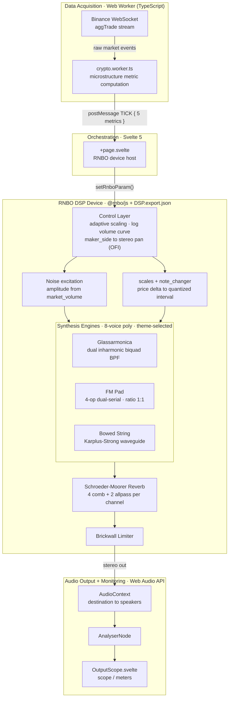

# SoniChain

**Real-time sonification of Binance market microstructure through an RNBO DSP engine.**

SoniChain translates a live crypto order flow into a continuous, low-fatigue acoustic field. Five market metrics drive three noise-excited synthesis engines (subtractive, FM, physical-model waveguide) and a Schroeder–Moorer diffusion network, so that market state can be monitored *peripherally* — as a "sixth sense" — rather than read off a chart.

Watch the live demo on YouTube: https://youtu.be/KYNdKtD0t8s


---

## Table of Contents

- [Overview](#overview)
- [Features](#features)
- [Architecture & Data Flow](#architecture--data-flow)
  - [Parameter Mapping](#parameter-mapping)
- [The RNBO Patch (DSP)](#the-rnbo-patch-dsp)
  - [Control & Routing Layer](#control--routing-layer)
  - [Engine A — Glassarmonica (Subtractive Resonator)](#engine-a--glassarmonica-subtractive-resonator)
  - [Engine B — FM Pad (Dual-Serial Frequency Modulation)](#engine-b--fm-pad-dual-serial-frequency-modulation)
  - [Engine C — Bowed String (Resonant Waveguide)](#engine-c--bowed-string-resonant-waveguide)
  - [Diffusion — Schroeder–Moorer Reverb](#diffusion--schroedermoorer-reverb)
- [Sound Design Rationale (Stylistic Choices)](#sound-design-rationale-stylistic-choices)
- [Tech Stack](#tech-stack)
- [Project Structure](#project-structure)
- [Getting Started](#getting-started)
  - [Prerequisites](#prerequisites)
  - [Installation](#installation)
  - [Development](#development)
  - [Build](#build)
- [The DSP Sync Workflow](#the-dsp-sync-workflow)
- [Data Source](#data-source)
- [References](#references)
- [License](#license)

---

## Overview

SoniChain is a desktop-and-web application that converts a live Binance data stream into a real-time auditory display. The design objective is not merely to *encode* data as sound, but to do so under an explicit **ergonomic constraint**: the listener must be able to keep the stream running in the background of attention for prolonged sessions without listening fatigue. Every mapping is therefore chosen against a psychoacoustic rationale (spatial imbalance cues, interval-based pitch motion instead of glissando, perceptually motivated timbral modulation) rather than against a naive linear data-to-frequency rule.

The audio engine is authored in **RNBO** (Cycling '74) and exported to a WebAssembly/JS runtime; the host application is a **SvelteKit 2 / Svelte 5** frontend that runs both as a web app and, via **Tauri 2**, as a native desktop shell. Market metrics are computed off the main thread in a TypeScript **Web Worker** and pushed to the DSP device through a strictly unidirectional control path.

---

## Features

- **Five-metric market sonification** — `volatility`, `price`, `market_volume`, `density`, `maker_side`, each mapped to a perceptually motivated DSP target.
- **Three switchable synthesis engines**, theme-selected at runtime: an inharmonic subtractive *glassarmonica*, a dual-serial *FM pad*, and a *Karplus–Strong / Jaffe–Smith* bowed-string waveguide.
- **8-voice polyphony per engine**, so price transients trigger discrete overlapping notes (harp-like decay overlap) instead of a continuous pitch sweep — no siren-effect glissando, reduced auditory fatigue.
- **Order-Flow-Imbalance spatialization** — sell pressure to the left channel, buy pressure to the right, giving an immediate non-symbolic map of market lean.
- **Schroeder–Moorer stereo reverb** with RT60 and damping driven by live market state.
- **Adaptive dynamic scaling** — a self-narrowing peak-detection window keeps the mapping calibrated across regime changes without manual re-ranging.
- **Selectable engagement** — a logarithmic `market_volume` sensitivity curve (Low / Mid / High) lets the user dial the display from a discreet macro-event alarm to full micro-structure immersion.
- **Built-in monitoring** — an `AnalyserNode`-backed `OutputScope` for scope/meter feedback.
- **Cross-platform** — pure web app in development, native desktop via Tauri 2.

---

## Architecture & Data Flow

The signal path is **strictly unidirectional**: the worker computes metrics, the Svelte orchestrator forwards them as RNBO parameters, the DSP device synthesizes audio, and the Web Audio graph routes it to the output and to the monitoring scope. There is no feedback path from audio back into the data layer.



**Pipeline in words:** `Binance WebSocket → crypto.worker.ts → postMessage(TICK) → +page.svelte → setRnboParam() → RNBO device → Web Audio (AudioContext) → speakers + AnalyserNode → OutputScope.svelte`.

### Parameter Mapping

Each market metric modulates a specific DSP target. The mapping is the core of the design: it is where market semantics become perceptual attributes.

| Market metric | DSP target | Perceptual intent |
| --- | --- | --- |
| `maker_side` (Order Flow Imbalance) | Stereo pan — **Bearish → L**, **Bullish → R** | Spatial, pre-attentive map of market lean; keeps the stereo center uncluttered |
| `price` (discrete Δ via `note_changer`) | Pitch / interval — **Δ > 0 → ascending**, interval width ∝ \|Δ\| | Direction *and* magnitude of price movement, communicated as a musical step |
| `market_volume` | Noise excitation amplitude (log curve; Low / Mid / High) | Event intensity; user-selectable immersion depth |
| `density` | Filter cutoff / brightness, comb gain, detune rate | "Proximity" and clarity; tighter trade flow reads as a fuller, closer, brighter sound |
| `volatility` | Decay / feedback / loop gain, reverb RT60 | Acoustic "memory": turbulent markets leave a persistent, reverberant tail |

---

## The RNBO Patch (DSP)

The DSP is a single RNBO export (`DSP.export.json`) composed of a control/routing layer, three polyphonic synthesis engines, and a diffusion network. The four signal-generating/processing cores are implemented as **RNBOScript codeboxes**; everything below is documented from those sources, which are the source of truth for constants and topology.

A recurring engineering theme across all codeboxes: **per-sample one-pole smoothing (τ ≈ 5–10 ms) on every control parameter** to suppress zipper noise on the discretized, WebSocket-rate updates, plus explicit safety clamps and denormal flushing.

### Control & Routing Layer

- **Ingest & master output.** The layer receives the five metrics, applies the spatialization and scaling logic, and feeds a **brickwall limiter** upstream of the stereo output.
- **Adaptive scaling subpatch.** Raw values are normalized to `[0.0, 1.0]` by a peak-detector with an **adaptive threshold** whose temporal window progressively narrows to track macroscopic range shifts — so a regime change (e.g. sideways → crash) re-ranges the display automatically, without manual recalibration.
- **`market_volume` sensitivity** is shaped by a **logarithmic transfer curve** with user-selectable Low / Mid / High settings, trading off macro-event salience against micro-structure detail.
- **Spatialization.** `maker_side` drives the stereo panorama as a direct read-out of Order Flow Imbalance: sell pressure (Bearish) → left, buy pressure (Bullish) → right.
- **Frequency assignment (`scales` + `note_changer`).** `scales` emits pre-quantized frequency arrays, constraining tonal output to the selected scale. `note_changer` computes the **discrete derivative** of the last two `price` ticks: a positive delta triggers ascending harmonic motion, with interval width proportional to \|Δ\|. This module also drives the **engine switch** based on the active UI theme.

### Engine A — Glassarmonica (Subtractive Resonator)

High-Q subtractive synthesis emulating the inharmonic spectrum of a glass harmonica.

- **Topology** — two parallel resonant **biquads** (Direct Form I), implemented as RBJ constant-0 dB-peak band-pass sections (`α = sin ω / 2Q`, `b0 = α/a0`, `b2 = −α/a0`, `a1 = −2cos ω/a0`, `a2 = (1−α)/a0`). The second filter is tuned to **f0 × 2.756**, an inharmonic partial ratio that gives the glass-like timbre. Coefficients are recomputed at sample rate to follow modulation.
- **Self-sustaining resonance** — a **cross-channel feedback** loop (`input_L = in1 + fb_R·feedback`, `input_R = in2 + fb_L·feedback`) sustains the ring across the stereo pair.
- **Excitation** — pre-weighted white noise, low-passed as a function of `density`.
- **Modulation** — `density` modulates the filter cutoff; `volatility` controls the feedback-loop gain. The codebox exposes `f0`, `Q`, and `feedback` as inlets; the metric-to-inlet mapping is applied upstream.

### Engine B — FM Pad (Dual-Serial Frequency Modulation)

A timbrally stable, noise-excited "warm bell" pad.

- **Topology** — four operators in two independent serial chains, **Op2 → Op1 (L)** and **Op4 → Op3 (R)**, at a **carrier:modulator ratio of 1:1**, yielding a fully harmonic spectrum (Chowning 1973: an integer ratio places every sideband on an integer multiple of f0).
- **Excitation model** — excitation is **100% external**: `in1`/`in2` carry `market_volume`-weighted noise. The noise is **never summed into the output**; instead it drives the FM modulation-index envelope and the feedback path, exactly as the excitation drives the delay line in a Karplus–Strong string. When the noise falls to zero, energy already in transit in the feedback path **continues to decay** by the coefficient from `in4` — a physical-tail behavior, not a hard cutoff.
- **Modulation index** — a stable floor (`0.35`) plus an envelope-driven component, hard-clamped to a ceiling of `2.55` (`0.35 + 2.2`). The range is deliberately conservative: at a 1:1 ratio, indices beyond ~4–5 collapse the spectrum into a dense buzz.
- **Decoupled envelopes (the key fix)** — two one-pole followers share the same noise source but serve perceptually distinct tasks. A **15 ms** follower drives *amplitude*; a slower **40 ms** follower drives the *modulation index*. The slower stage sits **below the lower roughness boundary** (Zwicker & Fastl: flutter to ~20 Hz, roughness 20–300 Hz), removing the residual band that a single 15 ms follower would otherwise pass into the index path as **PM-index jitter** — i.e. audible grain / spurious sidebands from phase modulation of the carrier at a perceptible rate. (The artifact was most audible in the reverb return, because the output leaky integrator and the reverb combs — both leaky-integrator topologies — accumulate and prolong it.)
- **Stereo width** — symmetric detune of up to **±1.5 Hz** between the two carrier chains (≈ 3 Hz beat) produces slow chorus-like "breathing," not perceived inharmonicity.
- **Decay** — a leaky integrator on the output models a Karplus–Strong-like physical tail post-excitation.
- **Modulation** — `density` governs the noise low-pass and the detune rate; `volatility` controls the leaky-integrator feedback.
- **Disclosure (from source):** no oversampling in this codebox; the conservative index keeps FM products clear of Nyquist. If f0 is pushed beyond ~1–2 kHz in sound-design, consider 2× oversampling at the patcher level.

### Engine C — Bowed String (Resonant Waveguide)

A continuously excited physical model (Karplus–Strong / Jaffe & Smith 1983) — the only string-bodied voice in the palette.

- **Topology** — a tuned **delay line** (length `sr / f0`, fractional, with 2-tap linear FIR interpolation) and filtered feedback. The external noise is injected continuously into the loop (project constraint: the excitor remains the external noise).
- **Root-cause stability fix (Revision 5).** The original one-pole loop filter had **unity DC gain for any feedback coefficient**, so that coefficient controlled only color, not decay — and in DC the loop degenerated into a perfect integrator over the delay period, accumulating any DC component of the excitation into unbounded growth and a fixed-frequency buzz independent of f0. The canonical fix introduces three explicit stages:
  1. an **explicit loop gain < 1** (`DECAY_MAX = 0.995`), separated from damping — this is the true decay, controlled by `volatility`;
  2. a **first-order DC blocker inside the loop** (`y[n] = x[n] − x[n−1] + R·y[n−1]`, `R = 0.999` ≈ 7–8 Hz cutoff @ 48 kHz), nulling the loop's DC gain so no DC ever circulates in the delay;
  3. **energy normalization of the injection** (`× (1 − loop_gain)`): at high Q the comb's resonant peak ≈ `1/(1 − loop_gain)` ≈ 200, so without compensation a strong injection (high `market_volume`) would saturate and clip. With it, steady-state amplitude tracks the injection level **independently of `loop_gain`**, while `loop_gain` controls only tail duration.
- **Analytic guarantee** — loop transfer `= HP(z)·loop_gain·LP(z)` with `|HP| ≤ 1`, `|LP| ≤ 1`, `loop_gain < 1` ⇒ loop gain `< 1` at all frequencies, and `→ 0` in DC. **Unconditionally stable.**
- **Damping** — a fixed-coefficient averaging filter `0.5·(x[n] + x[n−1])` (zero at Nyquist), classic K–S, frequency-invariant. The two excitation stages — brightness LP and resonant comb, both **`density`-controlled** — are strictly feedforward, outside the loop.
- **Transitions** — a linear **crossfade** (`XFADE_SAMPLES = 480`) on real fundamental jumps eliminates phase clicks from delay-buffer discontinuity.
- **Disclosure (from source):** not empirically verified in this context (no RNBO runtime available at authoring time). Linear delay interpolation has a less flat high-frequency phase than an allpass (Välimäki & Laakso 2000) but is intrinsically stable.

### Diffusion — Schroeder–Moorer Reverb

A dedicated stereo spatial processor for the FM and waveguide voices.

- **Topology** — **4 parallel comb filters + 2 cascaded allpass per channel** (Schroeder 1962; Moorer 1979), with in-loop damping. RT60→gain derivation follows Smith, *Physical Audio Signal Processing* (CCRMA) — the same reference used by the waveguide module.
- **Decorrelation** — comb lengths are **coprime** and decorrelated L/R (Dattorro 1997) to maximize echo density without audible periodicity. Lengths are specified in samples at 48 kHz and auto-rescaled by `sr / 48000` to preserve the temporal ratios.
- **Decay law** — Schroeder's `g = 10^(−3·d / (RT60·sr))` gives exactly −60 dB at `t = RT60`. A one-pole LPF in each comb loop (`damping`) models the faster HF absorption of real absorptive materials (Kuttruff, *Room Acoustics*).
- **Allpass diffusion** — `y[n] = −g·x[n] + x[n−d] + g·y[n−d]`, `g = 0.6` (within `[0.5, 0.7]` for guaranteed stability and density without metallic coloration).
- **Wet/dry** — a deliberately **linear** mix. Because the reverb is additive and the dry/wet sum is decorrelated, a linear crossfade does not produce the loudness dip of an equal-power crossfade between correlated signals — so linear is the correct choice here, not an omission.
- **Modulation** — `volatility` scales RT60; `density` controls the damping (brightness).

---

## Sound Design Rationale (Stylistic Choices)

> *The art of listening to data: psychoacoustic and UX choices in market sonification.*

Translating a financial data stream into sound is a UX problem, not just a technical one. The primary objective is to let the brain process market complexity **in the background** — intuitively, and without the listening fatigue typical of long sessions. Every market parameter is therefore bound to a deliberate psychoacoustic metaphor.

**Logical spatialization — the weight of the market.** `maker_side`, the order-flow imbalance, governs the stereo panorama. Sell pressure (Bearish) is steered left, buy pressure (Bullish) right. The listener does not decode a complex timbre; they physically *feel* which way the market is leaning. The hard L/R separation also keeps the stereo center uncluttered, in line with the visual interface.

**Price — intervals, not glissando.** The most critical datum uses a universal auditory metaphor: a rise in price raises pitch, a fall lowers it, and **larger price moves produce wider harmonic leaps**, communicating intensity instantly. Crucially for the listener's ear, the system avoids glissando — the continuous "siren" slide. By assigning **8 polyphonic voices** per engine, price transients trigger discrete notes that overlap fluidly, producing an organic, harp- or natural-reverb-like field. This removes the sense of artificiality and makes prolonged listening restful.

**Timbre & texture — hearing density and volatility.** `density` controls brightness and filter cutoff: a denser market sounds *closer*, clearer, more present; in the FM pad it also introduces slight detuning whose slow beats read as "thickness" and "breath" rather than mistuning. `volatility` acts on decay and reverb tail: psychoacoustically it models *memory* / turbulence — in a highly volatile market, events leave a persistent acoustic wake and fuse into a reverberant, chaotic ambience; as volatility drops, the acoustic space dries out, becoming intimate, precise, defined.

**Adaptability & cognitive load.** A display that screams at every spike quickly becomes intolerable. Adaptive logic continuously re-ranges the value excursion in the background, so a regime change re-scales smoothly rather than clipping. The logarithmic `market_volume` sensitivity curve then lets the user choose their level of involvement: **Low** acts as a discreet alarm for macro-events only; **High** allows total immersion in the market's micro-pulse.

In short, the sound design moves past literal data playback toward **sensory ergonomics** — intensity becomes harmonic amplitude, imbalance becomes physical space, turbulence becomes acoustic persistence — yielding a monitoring instrument that does not fatigue, but integrates as a genuine sixth sense for market behavior.

---

## Tech Stack

| Layer | Technology |
| --- | --- |
| Frontend / orchestration | **SvelteKit 2**, **Svelte 5** (`+page.svelte` as orchestrator) |
| Audio engine | **RNBO** Web export via **`@rnbo/js` 1.3.4**, loaded from `static/DSP.export.json` |
| Data layer | TypeScript **Web Worker** (`crypto.worker.ts`) — Binance **WebSocket** + metric computation |
| Audio I/O & monitoring | **Web Audio API** directly — `AudioContext` + `AnalyserNode` (no wrapper) |
| Build tool | **Vite 6**, with a custom `sync-dsp` plugin |
| Desktop shell | **Tauri 2** (Rust); the frontend also runs as a pure web app in development |
| Dev server | Fixed port **1420** (`strictPort: true`) |

---

## Project Structure

```text
SoniChain/
├── src/
│   ├── routes/
│   │   ├── +page.svelte          # Orchestrator: hosts the RNBO device, wires worker → setRnboParam
│   │   └── +layout.ts            # Disables SSR globally (SPA mode for Tauri)
│   ├── components/
│   │   ├── AudioControls.svelte  # Volume fader, asset / scale / sensitivity selectors, play/pause
│   │   ├── CryptoChart.svelte    # Price history chart with musical-note overlay
│   │   └── OutputScope.svelte    # AnalyserNode-backed scope / goniometer / dB meters
│   ├── RNBO/
│   │   ├── DSP1.json             # Authoring-side RNBO export (source of truth for the DSP)
│   │   ├── DSP1.license
│   │   └── dependencies.json
│   ├── crypto.worker.ts          # Binance WebSocket + microstructure metric computation
│   ├── themes.ts                 # Three themes (graphite / slate / bone) as CSS vars + canvas hex
│   ├── help.ts                   # Contextual help-bubble store + Svelte `help` action
│   └── app.html                  # SPA HTML shell
├── static/
│   └── DSP.export.json           # Runtime device, synced from src/RNBO/DSP1.json — do not edit
├── src-tauri/
│   ├── src/
│   │   ├── main.rs               # Tauri entry point
│   │   └── lib.rs                # Tauri commands
│   ├── tauri.conf.json           # Window config: 800×600, title "SoniChain"
│   ├── Cargo.toml
│   ├── build.rs
│   └── capabilities/             # Tauri v2 security capabilities
├── vite.config.js                # Vite 6 config + sync-dsp plugin + strictPort 1420
└── package.json
```

---

## Getting Started

### Prerequisites

- **Node.js** ≥ 20 (required by Vite 6 / SvelteKit 2) and a package manager (npm / pnpm).
- **Rust** (stable toolchain) and the platform-specific **Tauri 2 prerequisites** — see the [Tauri prerequisites guide](https://v2.tauri.app/start/prerequisites/) — only needed for the desktop build.
- A network connection for the Binance WebSocket feed.

### Installation

```bash
git clone https://github.com/BitResonant/SoniChain.git
cd SoniChain
npm install
```

### Development

Run the frontend as a pure web app (dev server on the fixed port **1420**):

```bash
npm run dev
```

Run inside the Tauri desktop shell:

```bash
npm run tauri dev
```

### Build

Web build:

```bash
npm run build
npm run preview      # serve the production build locally
```

Native desktop bundle:

```bash
npm run tauri build
```

### Type-checking

```bash
npm run check        # svelte-kit sync + svelte-check (strict TypeScript)
npm run check:watch  # same, in watch mode
```

This is the only automated correctness gate — run it after any TypeScript or Svelte change.

---

## The DSP Sync Workflow

The RNBO patch is authored as `src/RNBO/DSP1.json` but consumed at runtime as `static/DSP.export.json`. A **custom Vite plugin, `sync-dsp`**, keeps them in lockstep:

- **On `buildStart`** — copies `src/RNBO/DSP1.json` → `static/DSP.export.json`.
- **During `dev`** — watches `src/RNBO/DSP1.json`; on change, re-copies and triggers a full page reload so the new device loads immediately without a manual restart.

**Workflow for editing the DSP:** edit the patch in RNBO, re-export to `src/RNBO/DSP1.json` — the dev server picks up the change automatically (or run `npm run build` for a production rebuild). Do not edit `static/DSP.export.json` by hand; it is a generated artifact.

---

## Data Source

Market data is sourced from **Binance** over a **WebSocket** connection, consumed in `crypto.worker.ts`. The worker computes the five microstructure metrics (`volatility`, `price`, `market_volume`, `density`, `maker_side`) off the main thread and pushes them to the orchestrator via `postMessage` `TICK` events. No credentials are required for public market streams.

---

## References

The DSP design is grounded in the following literature, as cited throughout the codeboxes:

- Chowning, J. M. (1973). *The Synthesis of Complex Audio Spectra by Means of Frequency Modulation.* Journal of the Audio Engineering Society, 21(7).
- Karplus, K., & Strong, A. (1983). *Digital Synthesis of Plucked-String and Drum Timbres.* Computer Music Journal, 7(2).
- Jaffe, D. A., & Smith, J. O. (1983). *Extensions of the Karplus–Strong Plucked-String Algorithm.* Computer Music Journal, 7(2).
- Schroeder, M. R. (1962). *Natural Sounding Artificial Reverberation.* Journal of the Audio Engineering Society, 10(3).
- Moorer, J. A. (1979). *About This Reverberation Business.* Computer Music Journal, 3(2).
- Dattorro, J. (1997). *Effect Design, Part 1: Reverberator and Other Filters.* Journal of the Audio Engineering Society, 45(9).
- Välimäki, V., & Laakso, T. I. (2000). *Principles of Fractional Delay Filters.* IEEE ICASSP.
- Zwicker, E., & Fastl, H. *Psychoacoustics: Facts and Models.* Springer.
- Kuttruff, H. *Room Acoustics.* CRC Press.
- Smith, J. O. *Physical Audio Signal Processing.* Online book, CCRMA, Stanford University.

---

## License

This project is distributed under the terms of the [`LICENSE`](./LICENSE) file in the repository root.

---

SoniChain — BitResonant
